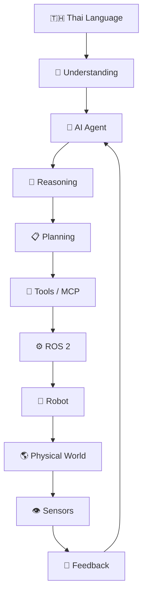
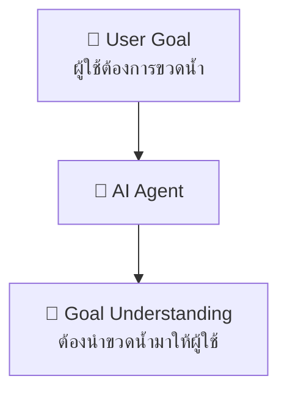
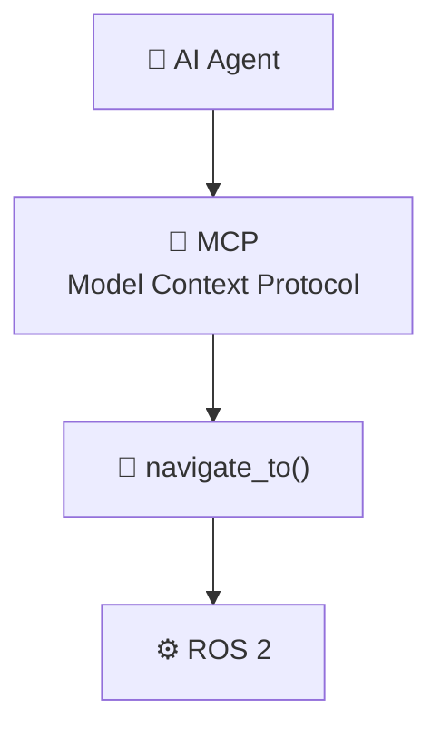
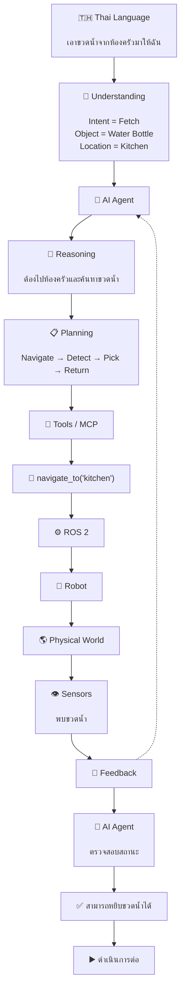
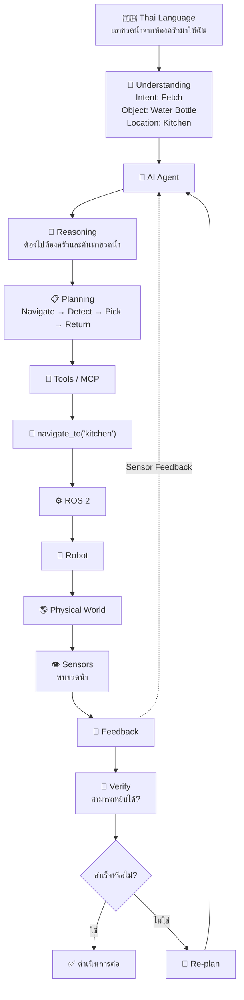
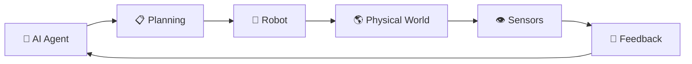
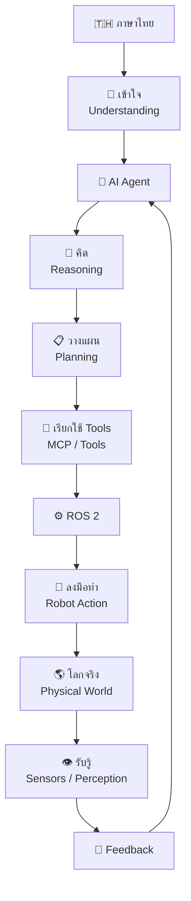

# อธิบาย  Robot Agent Thai

กระบวนการทำงาน นี้แสดง **กระบวนการทำงานของ Robot Agent ที่เข้าใจภาษาไทยและสามารถนำคำสั่งไปปฏิบัติในโลกจริง** โดยมีลักษณะเป็นวงจร **รับคำสั่ง → เข้าใจ → คิด → วางแผน → ใช้เครื่องมือ → ควบคุมหุ่นยนต์ → รับข้อมูลกลับ → ปรับการตัดสินใจ**



---

## 1. 🇹🇭 Thai Language — ภาษาไทย

เป็น **จุดเริ่มต้นของการสื่อสารระหว่างมนุษย์กับ Robot Agent**

ผู้ใช้สามารถสั่งงานด้วยภาษาไทยผ่าน

* ข้อความ
* เสียงพูด
* Chat
* Voice Assistant

### ตัวอย่าง

> “ช่วยไปเอาขวดน้ำในห้องครัวมาให้ฉันหน่อย”

ระบบจะนำข้อความหรือเสียงภาษาไทยเข้าสู่กระบวนการประมวลผล

```text
👤 ผู้ใช้
   ↓
🇹🇭 "ไปเอาขวดน้ำในห้องครัวมาให้ฉัน"
```

---

# 2. 🧠 Understanding — การทำความเข้าใจ

ขั้นตอนนี้คือการทำให้ AI **เข้าใจความหมายของคำสั่งภาษาไทย**

ระบบต้องวิเคราะห์ เช่น

* Intent — ผู้ใช้ต้องการอะไร
* Object — ต้องการสิ่งของอะไร
* Location — สิ่งของอยู่ที่ไหน
* Action — ต้องทำอะไร
* Target — ต้องนำไปให้ใคร
* Context — บริบทของคำสั่ง

ตัวอย่าง

```text
"ไปเอาขวดน้ำในห้องครัวมาให้ฉัน"

Intent    = Fetch Object
Object    = ขวดน้ำ
Location  = ห้องครัว
Action    = หยิบ / นำมา
Target    = ผู้ใช้
```

ดังนั้น Understanding คือขั้นตอน

> **จาก “ภาษา” → “ความหมายที่ AI สามารถนำไปใช้ต่อได้”**

---

# 3. 🤖 AI Agent — ตัวกลางในการตัดสินใจ

หลังจากเข้าใจคำสั่งแล้ว ข้อมูลจะถูกส่งเข้าสู่ **AI Agent**

AI Agent ทำหน้าที่เป็น **ศูนย์กลางการควบคุมและประสานงาน**

สามารถจัดการ

* Goal
* Context
* Memory
* Knowledge
* Tools
* Reasoning
* Planning
* Decision Making

ตัวอย่าง


```text
User Goal
   ↓
AI Agent
   ↓
"ต้องนำขวดน้ำมาให้ผู้ใช้"
```

AI Agent จะไม่จำเป็นต้องทำทุกอย่างด้วยตัวเอง แต่สามารถเลือกใช้เครื่องมือที่เหมาะสม

---

# 4. 🧠 Reasoning — การใช้เหตุผล

ขั้นตอนนี้คือการตอบคำถามว่า

> **“ฉันควรทำอย่างไรเพื่อให้บรรลุเป้าหมาย?”**

ตัวอย่าง:

```text
เป้าหมาย:
นำขวดน้ำมาให้ผู้ใช้

Reasoning:
1. ขวดน้ำอยู่ที่ไหน?
2. ห้องครัวอยู่ทางไหน?
3. มีสิ่งกีดขวางหรือไม่?
4. Robot เดินไปได้หรือไม่?
5. ต้องใช้แขนกลหรือไม่?
6. จับขวดน้ำอย่างไร?
7. ต้องนำกลับมาที่ตำแหน่งใด?
```

นี่เป็นส่วนสำคัญที่ทำให้ Robot Agent แตกต่างจากระบบ Automation แบบกำหนดกฎตายตัว

---

# 5. 📋 Planning — การวางแผน

หลังจาก Reasoning แล้ว AI Agent จะเปลี่ยนเป้าหมายใหญ่ให้เป็น **ขั้นตอนย่อย**

ตัวอย่าง:

```text
Goal:
นำขวดน้ำมาให้ผู้ใช้

        ↓

Task Plan

1. ค้นหาห้องครัว
2. เดินทางไปห้องครัว
3. ค้นหาขวดน้ำ
4. ตรวจสอบตำแหน่งขวด
5. เคลื่อนแขนกล
6. จับขวด
7. ตรวจสอบว่าจับสำเร็จ
8. เดินกลับหาผู้ใช้
9. ส่งมอบขวดน้ำ
```

เรียกว่า **Task Decomposition**

---

# 6. 🔌 Tools / MCP — เครื่องมือสำหรับ Agent

AI Agent ไม่ควรควบคุม Hardware โดยตรงทุกกรณี

จึงมี **Tool Layer** เป็นตัวกลาง

ตัวอย่าง Tools:

```text
navigate_to(location)

detect_object(object)

pick_object(object)

drop_object(location)

get_robot_status()

get_battery()

stop_robot()
```

สามารถใช้ **MCP (Model Context Protocol)** เป็นแนวทางในการเชื่อม Agent กับ Tools ต่าง ๆ

ตัวอย่าง:


```text
AI Agent
    ↓
MCP
    ↓
navigate_to()
    ↓
ROS 2
```

ดังนั้น MCP สามารถทำหน้าที่เป็นสะพานระหว่าง **AI Agent กับความสามารถของระบบภายนอก**

---

# 7. ⚙️ ROS 2 — Robotics Middleware

**ROS 2** ทำหน้าที่เป็น Middleware สำคัญในระบบ Robotics

โดยช่วยเชื่อมระหว่าง

```text
AI Agent
    ↓
ROS 2
    ↓
Navigation
    ↓
Controller
    ↓
Motor
```

ตัวอย่างเช่น Agent สั่งว่า

```text
"ไปห้องครัว"
```

AI Agent อาจแปลงเป็นคำสั่งระดับสูง:

```text
navigate_to("kitchen")
```

จากนั้น ROS 2 และระบบ Navigation จะจัดการรายละเอียดด้าน Robotics ต่อไป

---

# 8. 🤖 Robot — หุ่นยนต์

เมื่อ ROS 2 ส่งคำสั่งไปยังระบบควบคุม Robot ก็เริ่มลงมือปฏิบัติจริง

Robot อาจประกอบด้วย

* Mobile Robot
* Robotic Arm
* Gripper
* Wheel
* Servo
* Motor
* Actuator

ตัวอย่าง:

```text
ROS 2
  ↓
Navigation Controller
  ↓
Motor Controller
  ↓
Motor
  ↓
Robot เคลื่อนที่
```

---

# 9. 🌎 Physical World — โลกจริง

Robot ไม่ได้ทำงานอยู่แค่ใน Software แต่ต้องโต้ตอบกับ **โลกจริง**

เช่น

* ห้อง
* โต๊ะ
* ประตู
* คน
* สิ่งของ
* พื้น
* กำแพง
* สิ่งกีดขวาง

ตัวอย่าง:

```text
Robot
  ↓
เดินไปห้องครัว
  ↓
พบเก้าอี้ขวางทาง
```

สถานการณ์นี้สำคัญมาก เพราะ Robot ไม่สามารถพึ่งพาแผนเดิมได้ตลอดเวลา

---

# 10. 👁️ Sensors — การรับรู้สภาพแวดล้อม

Robot ต้องมี Sensors เพื่อรับข้อมูลจากโลกจริง

ตัวอย่าง:

| Sensor         | หน้าที่           |
| -------------- | ----------------- |
| 📷 Camera      | มองเห็นวัตถุ      |
| 📡 LiDAR       | ตรวจวัดระยะ       |
| 🧭 IMU         | ตรวจการเคลื่อนไหว |
| 📍 GPS         | ระบุตำแหน่ง       |
| ✋ Force Sensor | ตรวจแรง           |
| 🎤 Microphone  | รับเสียง          |

ตัวอย่าง:

```text
Camera
   ↓
ตรวจพบขวดน้ำ

LiDAR
   ↓
ตรวจพบสิ่งกีดขวาง

IMU
   ↓
ตรวจสอบการเคลื่อนไหว
```

---

# 11. 🔄 Feedback — ข้อมูลย้อนกลับ

นี่คือจุดที่ทำให้ระบบกลายเป็น **Agentic Loop**

Robot ส่งข้อมูลกลับไปยัง AI Agent

```text
Robot
  ↓
Sensors
  ↓
Feedback
  ↓
AI Agent
```

ตัวอย่าง:

```text
คำสั่ง:
"หยิบขวดน้ำ"

       ↓

Robot พยายามหยิบ

       ↓

Camera ตรวจสอบ

       ↓

พบว่า:
"จับไม่สำเร็จ"

       ↓

Feedback

       ↓

AI Agent
       ↓
Reasoning ใหม่
       ↓
ปรับแผน
       ↓
ลองอีกครั้ง
```

---
ได้เลยครับ นี่คือ **Mermaid Flowchart** ที่แปลงจาก Flow ที่ให้มา โดยจัดเป็นขั้นตอนชัดเจนตั้งแต่ **ภาษาไทย → AI Agent → Planning → MCP → ROS 2 → Robot → Sensor → Feedback → Agent**



### แบบเน้น Agent Loop

ถ้าต้องการให้เห็นว่า **Robot ไม่ได้ทำงานแบบเส้นตรง แต่มี Feedback กลับมาให้ AI Agent ตัดสินใจใหม่** แนะนำ Diagram นี้:



**แก่นของระบบคือ**

```text
🇹🇭 ภาษาไทย
      ↓
🧠 เข้าใจ
      ↓
🤖 Agent
      ↓
🧠 Reasoning
      ↓
📋 Planning
      ↓
🔌 MCP
      ↓
⚙️ ROS 2
      ↓
🤖 Robot
      ↓
🌎 โลกจริง
      ↓
👁️ Sensor
      ↓
🔄 Feedback
      ↺
🤖 Agent
```

นี่คือโครงสร้าง **Agentic Robot Loop** ที่สำคัญมาก เพราะ AI Agent สามารถ **ตรวจสอบผลการกระทำและวางแผนใหม่ (Re-planning)** แทนการทำงานตามคำสั่งแบบตายตัวครับ

# 12. 🔄 ทำไม Feedback จึงวนกลับไปที่ AI Agent?

ส่วนนี้คือหัวใจของ Diagram:



ระบบไม่ได้ทำงานแบบ

```text
Input → Action → End
```

แต่ทำงานแบบ

```text
Observe
   ↓
Understand
   ↓
Reason
   ↓
Plan
   ↓
Act
   ↓
Observe Result
   ↓
Verify
   ↓
Re-plan
   ↺
```

จึงเรียกว่า **Agent Loop**

---

# 13. ตัวอย่างการทำงานแบบครบวงจร

ผู้ใช้พูดว่า:

> **“ช่วยเอาขวดน้ำจากห้องครัวมาให้ฉัน”**

ระบบทำงานดังนี้

```text
🇹🇭 Thai Language
        ↓
"เอาขวดน้ำจากห้องครัวมาให้ฉัน"
        ↓
🧠 Understanding
        ↓
Intent = Fetch
Object = Water Bottle
Location = Kitchen
        ↓
🤖 AI Agent
        ↓
🧠 Reasoning
        ↓
"ต้องไปห้องครัวและค้นหาขวดน้ำ"
        ↓
📋 Planning
        ↓
Navigate → Detect → Pick → Return
        ↓
🔌 Tools / MCP
        ↓
navigate_to("kitchen")
        ↓
⚙️ ROS 2
        ↓
🤖 Robot
        ↓
🌎 Physical World
        ↓
👁️ Sensors
        ↓
"พบขวดน้ำ"
        ↓
🔄 Feedback
        ↓
🤖 AI Agent
        ↓
ตรวจสอบสถานะ
        ↓
"สามารถหยิบได้"
        ↓
ดำเนินการต่อ
```

---

# 14. สรุป Architecture

สามารถสรุป Robot Agent Thai เป็น 4 กลุ่มใหญ่ได้

### 🗣️ 1. Communication

```text
🇹🇭 Thai Language
       ↓
🧠 Understanding
```

**มนุษย์สื่อสารกับ Robot**

---

### 🧠 2. Intelligence

```text
🤖 AI Agent
       ↓
🧠 Reasoning
       ↓
📋 Planning
```

**Robot คิดและวางแผน**

---

### ⚙️ 3. Execution

```text
🔌 Tools / MCP
       ↓
⚙️ ROS 2
       ↓
🤖 Robot
```

**Robot ลงมือทำ**

---

### 🌎 4. Perception & Feedback

```text
🌎 Physical World
       ↓
👁️ Sensors
       ↓
🔄 Feedback
       ↓
🤖 AI Agent
```

**Robot รับรู้ผลลัพธ์และปรับการทำงาน**

---

# 15. ภาพรวมแนวคิด


```text
🇹🇭 ภาษาไทย
     ↓
🧠 เข้าใจ
     ↓
🤖 AI Agent
     ↓
🧠 คิด
     ↓
📋 วางแผน
     ↓
🔌 เรียกใช้ Tools
     ↓
⚙️ ROS 2
     ↓
🤖 ลงมือทำ
     ↓
🌎 โลกจริง
     ↓
👁️ รับรู้
     ↓
🔄 Feedback
     ↓
🤖 AI Agent
     ↺
```

**หัวใจของ Robot Agent Thai คือ**

> **“ฟังภาษาไทย → เข้าใจเป้าหมาย → คิดและวางแผน → ใช้เครื่องมือ → ควบคุมหุ่นยนต์ → รับรู้ผลลัพธ์ → ปรับแผน → ทำงานจนบรรลุเป้าหมาย”**

นี่จึงไม่ใช่แค่ **Thai Voice Control Robot** แต่เป็นแนวคิดของ **Thai Agentic Robotics / Thai Embodied AI / Thai Physical AI** ที่ให้หุ่นยนต์สามารถใช้ภาษาไทยเป็นช่องทางสื่อสารและใช้ Agent Loop เป็นกลไกในการตัดสินใจและปฏิบัติงานจริง.
