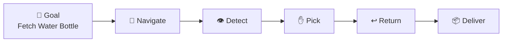
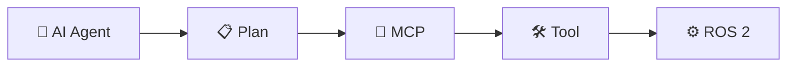
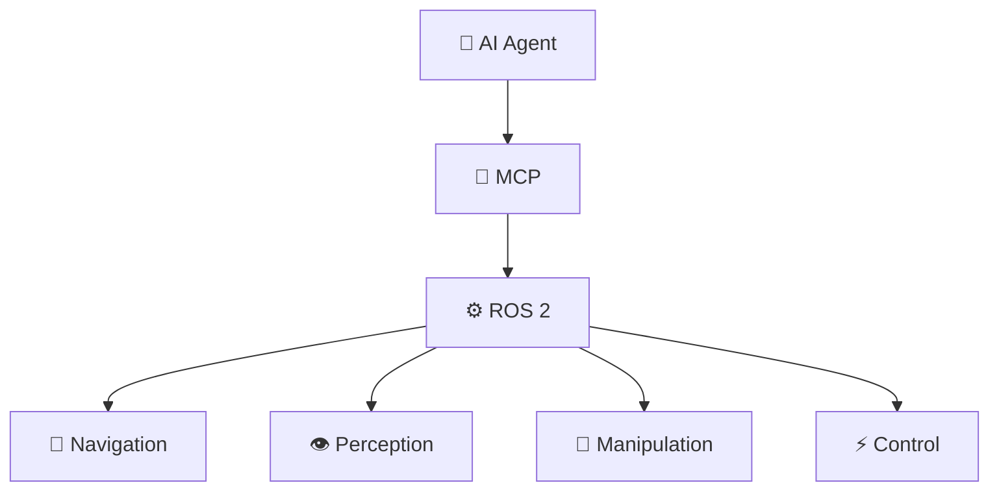
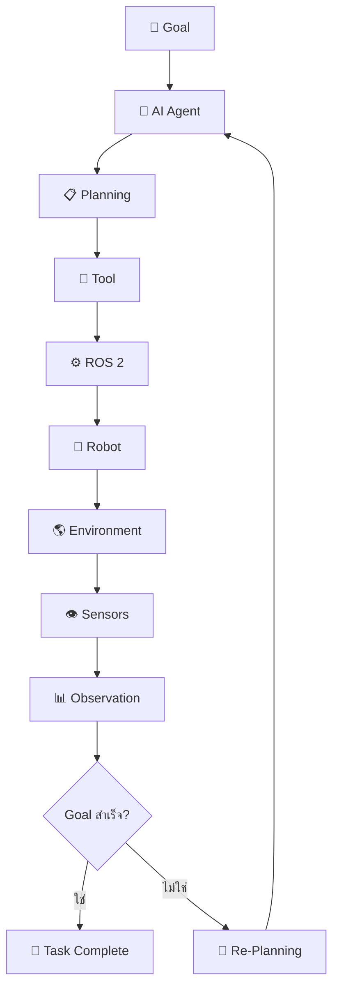
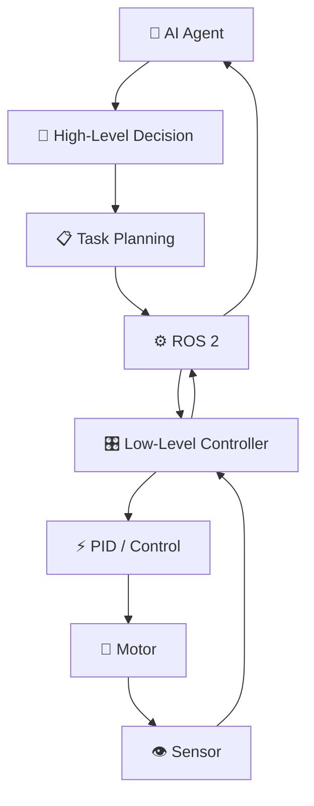
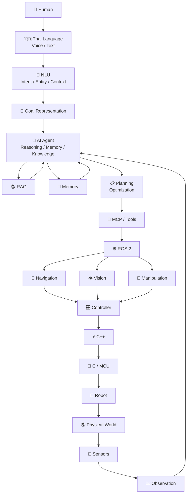
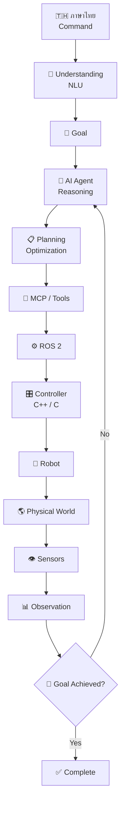

# ภาษาสำหรับหุ่นยนต์ (Languages for Robotics) 🤖🇹🇭

> **ภาษาสำหรับหุ่นยนต์** ในยุค AI ไม่ได้หมายถึงภาษาโปรแกรมเพียงภาษาเดียว แต่เป็นการทำงานร่วมกันของ **ภาษามนุษย์ + AI + AI Agent + MCP + ROS 2 + C++/C + Sensors + Control System** เพื่อเปลี่ยนคำสั่งของมนุษย์ให้กลายเป็นการกระทำในโลกจริง และใช้ข้อมูลจาก Sensors กลับมาปรับการตัดสินใจอย่างต่อเนื่อง

---

# 1. ภาพรวมระบบ Robot Agent

ระบบสามารถมองเป็นวงจร

```mermaid
flowchart TD

    A["🇹🇭 Thai Language<br/>ภาษาไทย / Voice / Text"]
    B["🧠 Understanding<br/>Intent / Entity / Context"]
    C["🤖 AI Agent<br/>Reasoning / Decision"]
    D["📋 Planning<br/>Task Planning"]
    E["🔌 MCP / Tools<br/>Tool Calling"]
    F["⚙️ ROS 2<br/>Robotics Middleware"]
    G["⚡ C++<br/>Robot Control"]
    H["🔧 C<br/>Embedded / Microcontroller"]
    I["🤖 Robot Hardware"]
    J["🌎 Physical World"]
    K["👁️ Sensors<br/>Camera / LiDAR / IMU"]
    L["🔄 Feedback"]

    A --> B
    B --> C
    C --> D
    D --> E
    E --> F
    F --> G
    G --> H
    H --> I
    I --> J
    J --> K
    K --> L
    L --> C
````

สามารถเขียนเป็นกระบวนการทางคณิตศาสตร์ได้ว่า

$$
Command
\rightarrow
Understanding
\rightarrow
Reasoning
\rightarrow
Planning
\rightarrow
Action
\rightarrow
Observation
\rightarrow
Feedback
$$

หรือ

$$
u_t
\rightarrow
z_t
\rightarrow
g_t
\rightarrow
p_t
\rightarrow
a_t
\rightarrow
o_{t+1}
\rightarrow
s_{t+1}
$$

โดย

| สัญลักษณ์ | ความหมาย              |
| --------- | --------------------- |
| $u_t$     | คำสั่งจากผู้ใช้       |
| $z_t$     | ความหมายที่ระบบเข้าใจ |
| $g_t$     | Goal                  |
| $p_t$     | Plan                  |
| $a_t$     | Action                |
| $o_{t+1}$ | Observation           |
| $s_{t+1}$ | สถานะใหม่ของ Robot    |

---

# 2. 🇹🇭 Human Language → Machine Representation

ตัวอย่างคำสั่ง:

> **"เอาขวดน้ำจากห้องครัวมาให้ฉัน"**

กำหนดให้

$$
u =
\text{"เอาขวดน้ำจากห้องครัวมาให้ฉัน"}
$$

ระบบ Natural Language Understanding จะเปลี่ยนคำสั่งเป็น Semantic Representation

$$
z=f_{NLU}(u)
$$

โดย

* $u$ = User Command
* $f_{NLU}$ = ฟังก์ชันทำความเข้าใจภาษา
* $z$ = ความหมายที่ระบบสกัดออกมา

ผลลัพธ์:

$$
z=
{
Intent,
Object,
Location,
Target,
Action
}
$$

ตัวอย่าง:

```text
Intent   = Fetch
Object   = Water Bottle
Location = Kitchen
Target   = User
Action   = Navigate + Pick + Return + Deliver
```

ดังนั้น

$$
f_{NLU}(u)
\rightarrow
z
$$

หมายถึง

> **แปลงภาษามนุษย์ให้กลายเป็นโครงสร้างข้อมูลที่ AI Agent สามารถนำไปคิดและวางแผนได้**

---

# 3. 🧠 Intent Classification

หนึ่งในงานสำคัญของ Understanding คือการหา **Intent**

ให้

$$
I^*=\arg\max_I P(I|u)
$$

โดย

* $I^*$ = Intent ที่ระบบเลือก
* $I$ = Intent ที่เป็นไปได้
* $u$ = User Command
* $P(I|u)$ = ความน่าจะเป็นของ Intent เมื่อได้รับคำสั่ง $u$

ตัวอย่าง:

```text
User:
"ไปห้องครัว"

Possible Intent:

Navigate = 0.95
Fetch    = 0.03
Search   = 0.02
```

ดังนั้น

$$
I^*=Navigate
$$

---

# 4. 🎯 Goal Representation

หลังจากเข้าใจคำสั่งแล้ว ระบบต้องสร้าง **Goal**

ตัวอย่าง:

```text
User Command:
"เอาขวดน้ำจากห้องครัวมาให้ฉัน"

Goal:
Fetch(WaterBottle, Kitchen, User)
```

เขียนเป็น

$$
g=G(z)
$$

โดย

* $z$ = Semantic Representation
* $G$ = Goal Generation
* $g$ = Goal

ดังนั้น

$$
u
\rightarrow
z
\rightarrow
g
$$

หรือ

$$
\text{ภาษาไทย}
\rightarrow
\text{ความหมาย}
\rightarrow
\text{เป้าหมาย}
$$

---

# 5. 🤖 AI Agent และการตัดสินใจ

AI Agent ต้องเลือก Action ที่เหมาะสม

กำหนด

* $s_t$ = สถานะของ Robot ณ เวลา $t$
* $g$ = Goal
* $o_t$ = Observation
* $k$ = Knowledge
* $m_t$ = Memory

AI Agent สามารถเขียนเป็น Policy ได้ว่า

$$
\boxed{
a_t=\pi(g,s_t,o_t,k,m_t)
}
$$

โดย

* $a_t$ = Action ที่ Robot ควรทำ
* $\pi$ = Policy หรือกลไกการตัดสินใจ
* $g$ = เป้าหมาย
* $s_t$ = สถานะปัจจุบัน
* $o_t$ = ข้อมูลที่ Robot รับรู้
* $k$ = Knowledge
* $m_t$ = Memory

ตัวอย่าง:

```text
navigate_to("kitchen")
```

หรือ

```text
pick_object("water_bottle")
```

---

## 5.1 ทำไมต้องมี $s_t$?

เพราะ Robot ต้องรู้ว่า **ตอนนี้ตัวเองอยู่ในสถานะอะไร**

ตัวอย่าง

$$
s_t =
[x,y,\theta,v,\omega,b]
$$

โดย

* $x,y$ = ตำแหน่ง Robot
* $\theta$ = ทิศทาง
* $v$ = ความเร็วเชิงเส้น
* $\omega$ = ความเร็วเชิงมุม
* $b$ = ระดับแบตเตอรี่

ตัวอย่าง:

```text
Position    = (2.5, 4.2)
Orientation = 90°
Velocity    = 0.5 m/s
Battery     = 72%
```

ดังนั้น Agent ไม่ได้ตัดสินใจจากคำสั่งเพียงอย่างเดียว แต่พิจารณา **สถานะจริงของ Robot** ด้วย

---

# 6. 🧠 Reasoning

Reasoning คือการประเมินว่า Action ใดเหมาะสมที่สุด

สามารถเขียนแบบง่ายว่า

$$
\boxed{
a_t^*=
\arg\max_{a\in A}
P(a|g,s_t,o_t,k,m_t)
}
$$

ความหมายคือ

> จาก Action ที่เป็นไปได้ทั้งหมด ให้เลือก Action ที่มีความเหมาะสมสูงที่สุด เมื่อพิจารณา Goal, State, Observation, Knowledge และ Memory

ตัวอย่าง:

```text
Goal:
เอาขวดน้ำมาให้ผู้ใช้

Possible Actions:

Go Kitchen
Go Bedroom
Go Living Room
Stay
```

Agent ประเมินแล้วเลือก

$$
a_t^*=GoKitchen
$$

---

# 7. 📋 Planning

เมื่อมี Goal แล้ว Agent ต้องสร้าง Plan

$$
P=Planner(g,s_t)
$$

โดย

* $g$ = Goal
* $s_t$ = Current State
* $P$ = Plan

ตัวอย่าง

$$
P=
[
Navigate,
Detect,
Pick,
Return,
Deliver
]
$$



---

# 8. 🧮 Planning เป็น Optimization Problem

การวางแผนของ Robot สามารถมองเป็นปัญหา Optimization

ให้

$$
P^*=\arg\min_{P}J(P)
$$

โดย

* $P^*$ = แผนที่ดีที่สุด
* $P$ = แผนที่เป็นไปได้
* $J(P)$ = Cost ของแผน

ตัวอย่าง Cost Function

$$
\boxed{
J(P)=
\alpha L(P)
+
\beta R(P)
+
\gamma E(P)
+
\delta T(P)
}
$$

โดย

* $L(P)$ = ระยะทาง
* $R(P)$ = ความเสี่ยง
* $E(P)$ = พลังงานที่ใช้
* $T(P)$ = เวลา
* $\alpha,\beta,\gamma,\delta$ = น้ำหนักของแต่ละปัจจัย

### ตัวอย่าง

```text
Path A
ระยะทาง = 10 m
ความเสี่ยง = สูง

Path B
ระยะทาง = 15 m
ความเสี่ยง = ต่ำ
```

Robot อาจเลือก Path B หาก Safety มีน้ำหนักสูงกว่า Distance

นี่คือเหตุผลที่ Robot ไม่จำเป็นต้องเลือก **"เส้นทางที่สั้นที่สุด"** แต่เลือก **"เส้นทางที่เหมาะสมที่สุด"**

---

# 9. 🔌 MCP และ Tool Calling

หลังจาก Plan แล้ว Agent ต้องเรียกใช้ Tool

ตัวอย่าง:

```text
navigate_to("kitchen")
```

สามารถเขียนทางคณิตศาสตร์ได้ว่า

$$
ToolCall:
T(n,args)
\rightarrow
Action
$$

เช่น

$$
T(
navigate_to,
kitchen
)
\rightarrow
ROS2\ Navigation
$$

Architecture:



---

# 10. ⚙️ ROS 2

ROS 2 ทำหน้าที่เป็น Middleware ระหว่าง AI และ Robot



ในเชิงระบบ

$$
Command_{AI}
\rightarrow
ROS2
\rightarrow
Controller
\rightarrow
Robot
$$

ROS 2 จึงเป็น **สะพานเชื่อมระหว่าง AI Software กับ Robotics Software/Hardware**

---

# 11. ⚡ Robot Control

Robot Control สามารถอธิบายด้วยสมการ State Transition

$$
\boxed{
s_{t+1}=f(s_t,a_t)
}
$$

หมายถึง

> เมื่อ Robot อยู่ในสถานะ $s_t$ และทำ Action $a_t$ แล้ว ระบบจะเปลี่ยนไปเป็นสถานะใหม่ $s_{t+1}$

ตัวอย่าง:

```text
สถานะเดิม:
Robot อยู่หน้าห้อง

Action:
navigate_to("kitchen")

↓

สถานะใหม่:
Robot อยู่ในห้องครัว
```

---

# 12. 🦾 Robot Arm และ Kinematics

สำหรับ Robot Arm เราสามารถกำหนด Joint Configuration เป็น

$$
q=
[q_1,q_2,\dots,q_n]^T
$$

โดย $q_i$ คือมุมของ Joint ที่ $i$

## Forward Kinematics

$$
\boxed{
x=f(q)
}
$$

หมายถึง

> จากมุม Joint ที่กำหนด สามารถคำนวณตำแหน่งของ End Effector ได้

## Inverse Kinematics

$$
\boxed{
q=f^{-1}(x)
}
$$

หมายถึง

> เมื่อกำหนดตำแหน่งที่ต้องการให้ปลายแขนไปถึง ต้องคำนวณว่าแต่ละ Joint ต้องหมุนเท่าไร

ตัวอย่าง:

```text
AI Agent
   ↓
"หยิบขวดน้ำ"
   ↓
Target Position
   ↓
Inverse Kinematics
   ↓
Joint Angles
   ↓
Robot Arm
```

---

# 13. 👁️ Computer Vision

Camera ให้ข้อมูลภาพ

$$
I_t
$$

จากนั้น AI/Vision Model วิเคราะห์

$$
o_t=f_{vision}(I_t)
$$

โดย

* $I_t$ = Image
* $f_{vision}$ = Vision Model
* $o_t$ = Observation

ตัวอย่าง

$$
P(WaterBottle|I_t)=0.92
$$

หมายถึงระบบประเมินว่าภาพดังกล่าวมีโอกาสเป็น **ขวดน้ำ 92%**

ดังนั้น

$$
P(WaterBottle|I_t)>\tau
$$

ถ้า Threshold

$$
\tau=0.80
$$

จะได้

$$
0.92>0.80
$$

จึงตัดสินว่า

> **พบขวดน้ำ**

---

# 14. 🧭 Navigation

Robot ต้องหาเส้นทางจากจุดเริ่มต้นไปยัง Goal

$$
S_{start}\rightarrow S_{goal}
$$

ให้เส้นทางเป็น

$$
P={p_1,p_2,\dots,p_n}
$$

Robot ต้องหา

$$
\boxed{
P^*=\arg\min_P J(P)
}
$$

ตัวอย่าง Cost

$$
J(P)=
\alpha Distance
+
\beta Risk
+
\gamma Energy
$$

ดังนั้น Robot อาจเลือก

```text
เส้นทาง A
ระยะทางสั้น
แต่มีสิ่งกีดขวาง

หรือ

เส้นทาง B
ระยะทางยาวกว่า
แต่ปลอดภัยกว่า
```

Agent จะเลือกตาม Cost Function

---

# 15. 🔄 Feedback Control

Robot ต้องเปรียบเทียบ

> **สิ่งที่ต้องการ** กับ **สิ่งที่เกิดขึ้นจริง**

กำหนด

$$
\boxed{
e(t)=r(t)-y(t)
}
$$

โดย

* $r(t)$ = Reference / Target
* $y(t)$ = ค่าที่วัดได้
* $e(t)$ = Error

ตัวอย่าง

```text
Target Position = 10 m
Actual Position = 8 m
```

ดังนั้น

$$
e=10-8=2m
$$

Robot ต้องปรับการเคลื่อนที่เพื่อลด Error

---

# 16. 🎛️ PID Control

ในระบบควบคุม Motor สามารถใช้ PID Controller

$$
\boxed{
u(t)=
K_Pe(t)
+
K_I\int_0^t e(\tau)d\tau
+
K_D\frac{de(t)}{dt}
}
$$

โดย

* $u(t)$ = Control Output
* $e(t)$ = Error
* $K_P$ = Proportional Gain
* $K_I$ = Integral Gain
* $K_D$ = Derivative Gain

### P — Proportional

ตอบสนองต่อ Error ปัจจุบัน

$$
K_Pe(t)
$$

ยิ่ง Error มาก ระบบยิ่งพยายามแก้ไขมาก

### I — Integral

สะสม Error ในอดีต

$$
K_I\int e(t)dt
$$

ช่วยลด Error ที่ค้างอยู่เป็นเวลานาน

### D — Derivative

พิจารณาการเปลี่ยนแปลงของ Error

$$
K_D\frac{de(t)}{dt}
$$

ช่วยลดการแกว่งและการตอบสนองที่รุนแรงเกินไป

ดังนั้น PID ช่วยให้ Robot ควบคุมการเคลื่อนไหวได้แม่นยำและเสถียรมากขึ้น

---

# 17. 🔄 Robot Agent Feedback Loop



---

# 18. 🧮 State-Space Model

Robot สามารถอธิบายด้วย State-Space Model

$$
\boxed{
x_{t+1}=Ax_t+Bu_t
}
$$

และ

$$
\boxed{
y_t=Cx_t+Du_t
}
$$

โดย

* $x_t$ = State
* $u_t$ = Control Input
* $y_t$ = Output
* $A$ = State Transition Matrix
* $B$ = Control Matrix
* $C$ = Observation Matrix
* $D$ = Direct Transmission Matrix

ใน Robot จริง สมการอาจเป็น Nonlinear System:

$$
x_{t+1}=f(x_t,u_t,w_t)
$$

โดย $w_t$ คือ Noise หรือ Disturbance

---

# 19. 🧠 AI Agent + Control System

จุดสำคัญคือ AI Agent และ Control System ทำงานคนละระดับ



### High-Level

AI Agent คิดว่า

> **"ไปห้องครัว"**

### Low-Level Controller

Controller คิดว่า

> **"ต้องหมุน Motor ซ้ายเท่าไรและขวาเท่าไร"**

ดังนั้น

$$
AI\ Agent
\neq
Motor\ Controller
$$

แต่ทำงานร่วมกัน

$$
AI\ Agent
\rightarrow
High-Level\ Command
\rightarrow
Controller
\rightarrow
Motor
$$

---

# 20. 🧠 Decision + Control

สามารถแบ่งเป็น 2 ระดับ

## ระดับที่ 1 — Decision

$$
a_t=\pi(g,s_t,o_t)
$$

AI Agent เลือก

> **ว่าจะทำอะไร**

## ระดับที่ 2 — Control

$$
u_t=K(s_t,a_t)
$$

Controller คำนวณ

> **จะควบคุม Motor อย่างไร**

ดังนั้น

$$
\boxed{
AI\ Agent
\rightarrow
Action
\rightarrow
Controller
\rightarrow
Motor
}
$$

---

# 21. 🎯 ตัวอย่างเต็ม: "เอาขวดน้ำมาให้ฉัน"

คำสั่ง:

```text
"เอาขวดน้ำจากห้องครัวมาให้ฉัน"
```

## ขั้นที่ 1 — Understanding

$$
z=f_{NLU}(u)
$$

ได้

```text
Intent   = Fetch
Object   = Water Bottle
Location = Kitchen
Target   = User
```

## ขั้นที่ 2 — Goal

$$
g=Fetch(WaterBottle,Kitchen,User)
$$

## ขั้นที่ 3 — Planning

$$
P=
[
Navigate,
Detect,
Pick,
Return,
Deliver
]
$$

## ขั้นที่ 4 — Tool Calling

```text
navigate_to("kitchen")
```

## ขั้นที่ 5 — ROS 2

```text
MCP
 ↓
ROS 2
 ↓
Navigation
```

## ขั้นที่ 6 — Robot Control

$$
s_{t+1}=f(s_t,a_t)
$$

## ขั้นที่ 7 — Vision

$$
P(WaterBottle|Image)>0.8
$$

## ขั้นที่ 8 — Feedback

$$
e(t)=r(t)-y(t)
$$

## ขั้นที่ 9 — Re-planning

ถ้าหยิบไม่ได้

$$
Observation
\rightarrow
Reasoning
\rightarrow
Replan
$$

---

# 22. 🧩 Complete Mathematical Model

สามารถรวมระบบทั้งหมดเป็น

## 22.1 Language Understanding

$$
\boxed{
z_t=f_{NLU}(u_t)
}
$$

แปลงคำสั่งภาษาไทยเป็นความหมาย

---

## 22.2 Goal Generation

$$
\boxed{
g_t=f_G(z_t)
}
$$

แปลงความหมายเป็นเป้าหมาย

---

## 22.3 Planning

$$
\boxed{
P_t=f_P(g_t,s_t,k,m_t)
}
$$

สร้างแผนจาก Goal, State, Knowledge และ Memory

---

## 22.4 Action Selection

$$
\boxed{
a_t=\pi(P_t,s_t,o_t)
}
$$

เลือก Action ที่เหมาะสม

---

## 22.5 Robot State Transition

$$
\boxed{
s_{t+1}=f_R(s_t,a_t,w_t)
}
$$

คำนวณสถานะใหม่ของ Robot หลังจากทำ Action

---

## 22.6 Observation

$$
\boxed{
o_{t+1}=h(s_{t+1},v_t)
}
$$

Sensors ตรวจสอบสถานะและสภาพแวดล้อม

---

## 22.7 Feedback

$$
\boxed{
o_{t+1}\rightarrow Agent
}
$$

นำข้อมูลกลับไปให้ AI Agent ตรวจสอบ

---

# 23. 🔄 Mathematical Agent Loop

ทั้งหมดสามารถรวมเป็น

$$
\boxed{
u_t
\rightarrow
z_t
\rightarrow
g_t
\rightarrow
P_t
\rightarrow
a_t
\rightarrow
s_{t+1}
\rightarrow
o_{t+1}
\rightarrow
Agent
}
$$

หรือ

$$
\boxed{
Understand
\rightarrow
Reason
\rightarrow
Plan
\rightarrow
Act
\rightarrow
Observe
\rightarrow
Feedback
\rightarrow
Replan
}
$$

นี่คือแกนหลักของ **Agentic Robotics**

---

# 24. 🏗️ Complete Robot Agent Thai Architecture



---

# 25. 📚 ภาษาที่ใช้ในระบบหุ่นยนต์

| ระดับ          | ภาษา / เทคโนโลยี | บทบาท                     |
| -------------- | ---------------- | ------------------------- |
| Human          | 🇹🇭 Thai        | คำสั่งมนุษย์              |
| AI             | Python           | AI / Agent / Vision       |
| AI             | LLM / VLM        | Understanding / Reasoning |
| Agent          | MCP              | Tool Interface            |
| Robotics       | ROS 2            | Middleware                |
| Control        | C++              | Robot Control             |
| Embedded       | C                | Hardware Control          |
| Industrial     | IEC 61131-3      | PLC                       |
| Robot-specific | RAPID            | ABB Robot                 |
| Robot-specific | KRL              | KUKA Robot                |
| Robot-specific | INFORM           | Yaskawa Robot             |
| Robot-specific | URScript         | Universal Robots          |

---

# 26. 📊 ตารางสรุปสมการ

| สมการ                 | ความหมาย                  |
| --------------------- | ------------------------- |
| $z=f_{NLU}(u)$        | แปลงภาษาเป็นความหมาย      |
| $I^*=\arg\max P(I|u)$ | เลือก Intent              |
| $g=G(z)$              | สร้าง Goal                |
| $P=Planner(g,s)$      | สร้างแผน                  |
| $P^*=\arg\min J(P)$   | หาแผนที่มี Cost ต่ำที่สุด |
| $a_t=\pi(g,s,o,k,m)$  | AI Agent เลือก Action     |
| $s_{t+1}=f(s_t,a_t)$  | Robot เปลี่ยน State       |
| $o_t=h(s_t)$          | Sensor สร้าง Observation  |
| $e(t)=r(t)-y(t)$      | คำนวณ Error               |
| $u(t)=PID(e)$         | Controller ควบคุมระบบ     |
| $x=f(q)$              | Forward Kinematics        |
| $q=f^{-1}(x)$         | Inverse Kinematics        |
| $x_{t+1}=Ax_t+Bu_t$   | State-Space Model         |
| $y_t=Cx_t+Du_t$       | Output Model              |

---

# 27. 🔑 สรุปแนวคิดสำคัญ

ระบบ **Robot Agent Thai** สามารถสรุปเป็น 5 กระบวนการหลัก

## 1. Understand

$$
Language\rightarrow Meaning
$$

Robot ต้องเข้าใจว่า

> **ผู้ใช้ต้องการอะไร**

---

## 2. Think

$$
Meaning\rightarrow Reasoning
$$

AI Agent ต้องคิดว่า

> **ควรทำอย่างไร**

---

## 3. Plan

$$
Goal\rightarrow Plan
$$

เปลี่ยนเป้าหมายให้เป็น

> **ขั้นตอนการทำงาน**

---

## 4. Act

$$
Plan\rightarrow Tool\rightarrow ROS2\rightarrow Robot
$$

เปลี่ยนแผนให้เป็น

> **การกระทำจริง**

---

## 5. Observe & Feedback

$$
Action\rightarrow Observation\rightarrow Feedback
$$

Robot รับข้อมูลจากโลกจริงแล้วส่งกลับไปให้ Agent เพื่อ

* ตรวจสอบ
* ประเมิน
* ปรับแผน
* ตัดสินใจใหม่
* ดำเนินการต่อ

---

# 28. 🚀 ภาพรวมสุดท้าย



---

# 29. 🧠 สมการแกนกลางของ Robot Agent

สมการสำคัญของระบบสามารถสรุปได้เป็น

$$
\boxed{
z_t=f_{NLU}(u_t)
}
$$

↓

$$
\boxed{
g_t=f_G(z_t)
}
$$

↓

$$
\boxed{
P_t=f_P(g_t,s_t,k,m_t)
}
$$

↓

$$
\boxed{
a_t=\pi(P_t,s_t,o_t)
}
$$

↓

$$
\boxed{
s_{t+1}=f_R(s_t,a_t,w_t)
}
$$

↓

$$
\boxed{
o_{t+1}=h(s_{t+1},v_t)
}
$$

↓

$$
\boxed{
o_{t+1}\rightarrow Agent
}
$$

ดังนั้นระบบทั้งหมดคือ

$$
\boxed{
\text{Human}
\rightarrow
\text{Language}
\rightarrow
\text{Understanding}
\rightarrow
\text{Goal}
\rightarrow
\text{Reasoning}
\rightarrow
\text{Planning}
\rightarrow
\text{MCP}
\rightarrow
\text{ROS 2}
\rightarrow
\text{Control}
\rightarrow
\text{Robot}
\rightarrow
\text{Physical World}
\rightarrow
\text{Sensors}
\rightarrow
\text{Feedback}
\rightarrow
\text{AI Agent}
}
$$

---

# 30. 🎯 บทสรุป

> **ภาษาสำหรับหุ่นยนต์ในยุค AI คือระบบภาษาหลายระดับที่ทำงานร่วมกัน**

```text
🇹🇭 Thai Language
        ↓
🧠 Understanding
        ↓
🎯 Goal
        ↓
🤖 AI Agent
        ↓
🧠 Reasoning
        ↓
📋 Planning
        ↓
🔌 MCP / Tools
        ↓
⚙️ ROS 2
        ↓
🎛️ Controller
        ↓
⚡ C++ / C
        ↓
🤖 Robot
        ↓
🌎 Physical World
        ↓
👁️ Sensors
        ↓
📊 Observation
        ↓
🔄 Feedback
        ↺
🤖 AI Agent
```

หัวใจของระบบคือ

$$
\boxed{
Perception
\rightarrow
Reasoning
\rightarrow
Planning
\rightarrow
Action
\rightarrow
Feedback
}
$$

ดังนั้น **Robot Agent** ไม่ได้เป็นเพียงโปรแกรมที่สั่งหุ่นยนต์ แต่เป็นระบบที่สามารถ

1. **เข้าใจภาษา**
2. **เข้าใจเป้าหมาย**
3. **คิดและให้เหตุผล**
4. **วางแผน**
5. **เรียกใช้ Tools**
6. **สั่งงานผ่าน ROS 2**
7. **ควบคุม Robot**
8. **รับรู้โลกจริงผ่าน Sensors**
9. **ตรวจสอบผลลัพธ์**
10. **ปรับแผนและทำงานต่อ**

ซึ่งเป็นรากฐานของแนวคิด **Agentic Robotics, Physical AI และ AI-Powered Robots** ในยุคใหม่

```
```
