# งานวิจัยที่เกี่ยวข้อง: Thai Language-Based Robot Agent

## 1. บทนำ

ในช่วง 10 ปีที่ผ่านมา งานวิจัยด้านหุ่นยนต์ได้พัฒนาอย่างรวดเร็ว จากระบบหุ่นยนต์ที่ทำงานตามโปรแกรมที่กำหนดไว้ล่วงหน้า ไปสู่ระบบที่สามารถ **เข้าใจภาษา วิเคราะห์สถานการณ์ วางแผน เรียกใช้เครื่องมือ และลงมือทำในโลกจริง**

แนวคิดดังกล่าวเกิดจากการผสานหลายเทคโนโลยีเข้าด้วยกัน ได้แก่

* Natural Language Processing (NLP)
* Large Language Models (LLMs)
* Vision-Language Models (VLMs)
* Vision-Language-Action (VLA)
* AI Agent
* Robot Planning
* Model Context Protocol (MCP)
* ROS 2
* Computer Vision
* Robot Control
* Sensor Feedback

ตัวอย่างคำสั่ง:

> **"เอาขวดน้ำจากห้องครัวมาให้ฉัน"**

สามารถเปลี่ยนเป็นกระบวนการ

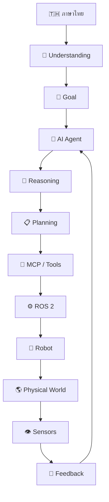

แกนหลักของระบบสามารถเขียนได้ว่า

$$
Language
\rightarrow
Understanding
\rightarrow
Reasoning
\rightarrow
Planning
\rightarrow
Action
\rightarrow
Observation
\rightarrow
Feedback
$$

---

# 2. วิวัฒนาการของ Language-Based Robotics

งานวิจัยในช่วง 10 ปีสามารถมองเป็นวิวัฒนาการ 5 ระยะ

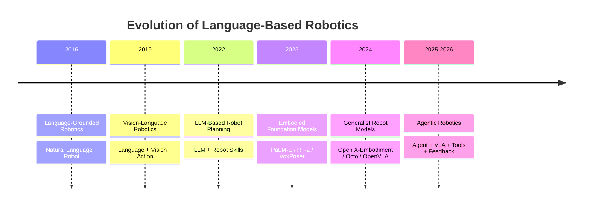

จุดเปลี่ยนที่สำคัญเกิดขึ้นในช่วง **2022–2025** เมื่อ Large Language Models เริ่มถูกนำมาใช้กับ Robotics โดยตรง

---

# 3. Language Grounding

ปัญหาพื้นฐานของ Robot Language Understanding คือ

> Robot จะเปลี่ยนคำพูดของมนุษย์ให้เป็นการกระทำจริงได้อย่างไร?

สามารถเขียนเป็น

$$
Language
\rightarrow
Meaning
\rightarrow
Action
$$

ตัวอย่าง

```text
"ไปหยิบแก้วน้ำ"

        ↓

Intent = Fetch

Object = Cup

Action = Pick
```

ทางคณิตศาสตร์

$$
z=f_{NLU}(u)
$$

โดย

* $u$ = User Command
* $f_{NLU}$ = Natural Language Understanding
* $z$ = Semantic Representation

จากนั้น

$$
g=f_G(z)
$$

โดย $g$ คือ Goal ของ Robot

ดังนั้น

$$
User\ Language
\rightarrow
Semantic\ Representation
\rightarrow
Robot\ Goal
$$

---

# 4. SayCan: Language Model + Robot Skills

Ahn et al. เสนอ **SayCan: Do As I Can, Not As I Say** ซึ่งเป็นงานสำคัญในการเชื่อม Language Model กับ Robot Skills [1]

แนวคิดสำคัญคือ Language Model สามารถช่วยวางแผนได้ แต่ Robot ต้องคำนึงถึงว่า **ตัวเองสามารถทำ Skill ใดได้จริง**

สามารถอธิบายได้ว่า

$$
P(skill|instruction)
\times
P(skill|world)
$$

ดังนั้น Robot จะเลือก Skill ที่

1. เหมาะสมกับคำสั่ง
2. สามารถทำได้ในสภาพแวดล้อมจริง

ตัวอย่าง

```text
User
 ↓
"เอาขวดน้ำมาให้ฉัน"
 ↓
LLM
 ↓
Navigate
 ↓
Find Bottle
 ↓
Pick Bottle
 ↓
Return
 ↓
Deliver
```

### ความสำคัญ

SayCan เป็นพื้นฐานสำคัญของแนวคิด

> **LLM + Robot Skills + Physical Affordance**

ซึ่งสามารถนำมาประยุกต์กับ Thai Robot Agent ได้โดยตรง

---

# 5. Inner Monologue: Reasoning จาก Feedback

Huang et al. เสนอ **Inner Monologue: Embodied Reasoning through Planning with Language Models** [2]

แนวคิดสำคัญคือ Robot ไม่ควรทำงานแบบ

$$
Command
\rightarrow
Plan
\rightarrow
Action
$$

เพียงครั้งเดียว

แต่ควรทำงานแบบ Closed Loop

$$
Command
\rightarrow
Plan
\rightarrow
Action
\rightarrow
Observation
\rightarrow
Reasoning
\rightarrow
Replanning
$$

ตัวอย่าง

```text
ผู้ใช้:
"เอาขวดน้ำมาให้ฉัน"

Robot:
ไปห้องครัว

Camera:
ไม่พบขวดน้ำ

Agent:
วิเคราะห์สถานการณ์

Agent:
ค้นหาบริเวณโต๊ะ

Robot:
เคลื่อนที่ไปโต๊ะ

Camera:
พบขวดน้ำ

Robot:
หยิบขวดน้ำ
```

แนวคิดนี้มีความสำคัญอย่างมากต่อ **Agentic Robotics**

---

# 6. Code as Policies

Liang et al. เสนอ **Code as Policies: Language Model Programs for Embodied Control** [3]

แนวคิดคือให้ Language Model สร้าง Code หรือ Program ที่สามารถควบคุม Robot ได้

$$
Natural\ Language
\rightarrow
LLM
\rightarrow
Robot\ Program
\rightarrow
Action
$$

ตัวอย่าง

```python
navigate_to("kitchen")
detect("water_bottle")
pick("water_bottle")
return_to("user")
```

สถาปัตยกรรมสามารถมองได้ว่า

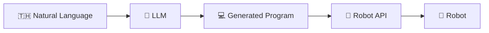

แนวคิดนี้เชื่อมโยงกับ Architecture สมัยใหม่

```text
AI Agent
    ↓
MCP
    ↓
Tools
    ↓
Robot API
    ↓
ROS 2
```

---

# 7. LLM+P: LLM + Classical Planning

Liu et al. เสนอ **LLM+P: Empowering Large Language Models with Optimal Planning Proficiency** [4]

แนวคิดสำคัญคือไม่ควรให้ LLM ทำทุกอย่างเอง

แต่ให้ LLM แปลงภาษามนุษย์เป็น Planning Problem แล้วใช้ Classical Planner ช่วยหาแผน

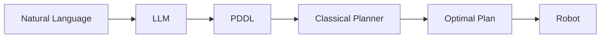

เขียนเป็น

$$
Language
\rightarrow
PDDL
\rightarrow
Planner
\rightarrow
Optimal\ Plan
$$

แนวคิดนี้แสดงให้เห็นว่า

> **LLM และ Classical Robotics Algorithms สามารถทำงานร่วมกันได้**

---

# 8. ChatGPT for Robotics

Vemprala et al. ศึกษาการประยุกต์ใช้ ChatGPT กับ Robotics [5]

แนวคิดหลักคือสร้าง High-Level Function Library ให้ Language Model สามารถเรียกใช้

```text
navigate()
move()
pick()
place()
detect()
```

Architecture:

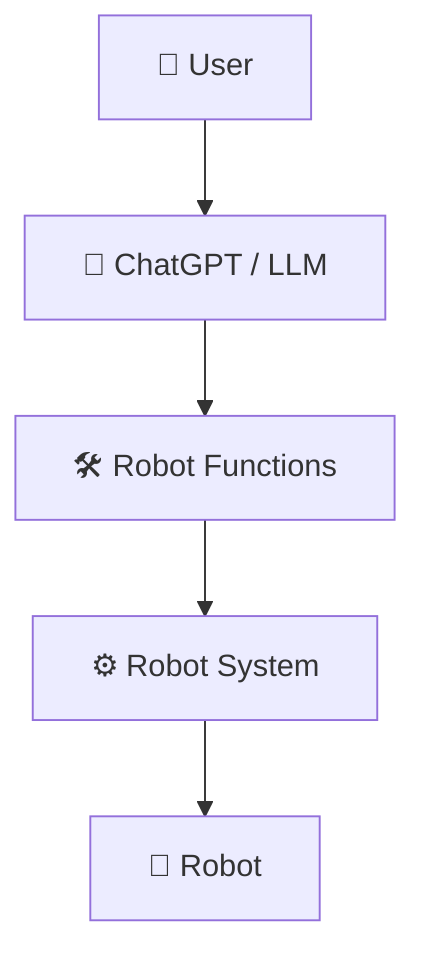

งานนี้มีความสำคัญต่อแนวคิด **Natural Language as Robot Interface**

---

# 9. PaLM-E: Embodied Multimodal Language Model

Driess et al. เสนอ **PaLM-E: An Embodied Multimodal Language Model** [6]

งานนี้ขยายจาก Language Model ไปสู่ Embodied AI โดยรวมข้อมูลหลายรูปแบบเข้าด้วยกัน

$$
Language
+
Vision
+
Robot\ State
\rightarrow
Embodied\ Reasoning
$$

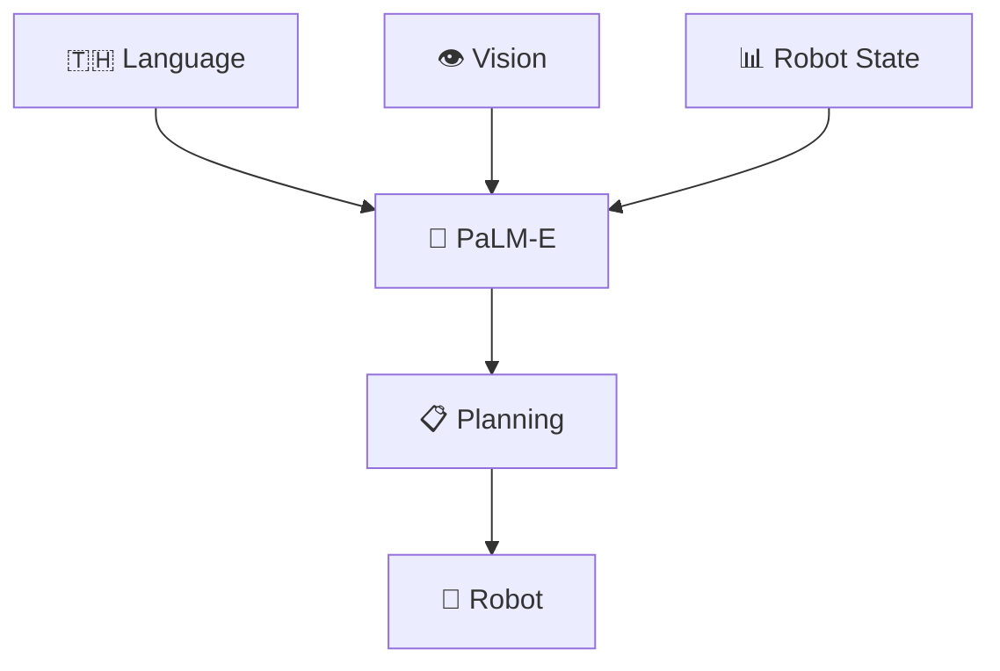

ความสำคัญคือ Robot ไม่ได้เข้าใจเพียงข้อความ แต่สามารถนำข้อมูลเกี่ยวกับโลกจริงเข้ามาประกอบการ Reasoning

---

# 10. RT-2: Vision-Language-Action

Zitkovich et al. เสนอ **RT-2: Vision-Language-Action Models Transfer Web Knowledge to Robotic Control** [7]

แนวคิดหลักคือ

$$
Vision
+
Language
\rightarrow
Action
$$

หรือ

```text
Camera Image
       +
Language Instruction
       ↓
Vision-Language-Action Model
       ↓
Robot Action
```

RT-2 แสดงให้เห็นแนวทางการนำความรู้จาก Vision-Language Models มาสู่ Robot Control

จึงเป็นรากฐานสำคัญของแนวคิด

> **Vision-Language-Action (VLA)**

---

# 11. VoxPoser

Huang et al. เสนอ **VoxPoser: Composable 3D Value Maps for Robotic Manipulation with Language Models** [8]

ปัญหาที่ VoxPoser พยายามแก้คือ

> LLM รู้ว่า Robot ควรทำอะไร แต่จะเปลี่ยนคำสั่งนั้นให้เป็นการเคลื่อนที่ในพื้นที่ 3D ได้อย่างไร?

แนวคิด

$$
Language
\rightarrow
LLM
\rightarrow
3D\ Value\ Map
\rightarrow
Motion\ Planning
\rightarrow
Robot
$$

ตัวอย่าง

```text
"หยิบขวดน้ำโดยไม่ชนแก้ว"

        ↓

LLM

        ↓

Object = Bottle
Constraint = Avoid Glass

        ↓

3D Value Map

        ↓

Motion Planner

        ↓

Robot Arm
```

งานนี้แสดงให้เห็นการเชื่อม

**Semantic Reasoning → 3D Physical Action**

---

# 12. Open X-Embodiment

Open X-Embodiment Collaboration เสนอชุดข้อมูลและโมเดลสำหรับ Generalist Robot Learning [9]

แนวคิดคือ

$$
Many\ Robots
+
Many\ Tasks
+
Many\ Environments
\rightarrow
Generalist\ Robot
$$

จากแนวคิดเดิม

```text
Robot A
 ↓
Train Model A
```

เปลี่ยนเป็น

```text
Robot A ─┐
Robot B ─┤
Robot C ─┤
Robot D ─┘
     ↓
Large Robot Dataset
     ↓
Generalist Robot Model
     ↓
Many Robots
```

นี่เป็นการเปลี่ยนแปลงสำคัญจาก **Task-Specific Robot** ไปสู่ **Generalist Robot**

---

# 13. Octo

Ghosh et al. เสนอ **Octo: An Open-Source Generalist Robot Policy** [10]

Octo เรียนรู้จาก Robot trajectories จำนวนมากและรองรับทั้ง Language Command และ Goal Image

Architecture:

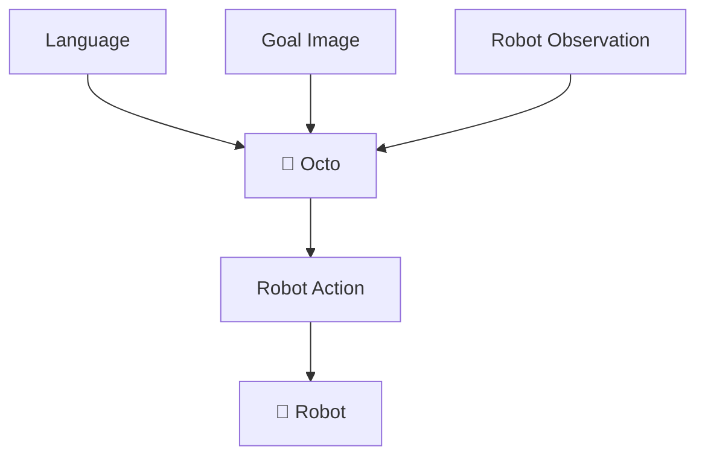

แนวคิดสำคัญคือการสร้าง **Generalist Robot Policy**

แทนการสร้าง Policy เฉพาะ Robot หรือ Task เดียว

---

# 14. OpenVLA

Kim et al. เสนอ **OpenVLA: An Open-Source Vision-Language-Action Model** [11]

แนวคิด

$$
Image
+
Language
\rightarrow
VLA
\rightarrow
Robot\ Action
$$

OpenVLA เป็นงานสำคัญสำหรับการศึกษาระบบ Vision-Language-Action แบบเปิด

Architecture:

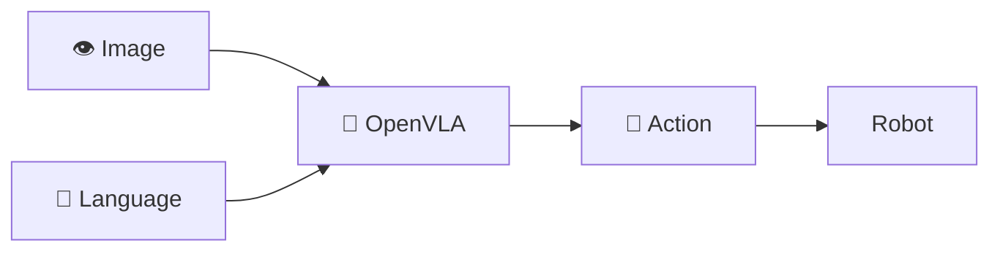

---

# 15. Gemini Robotics และ Physical AI

งานในปี 2025 เช่น Gemini Robotics แสดงทิศทางของ Robotics Foundation Models ที่มุ่งสู่การทำงานในโลกจริง [12]

แนวคิดกำลังขยายจาก

$$
LLM
$$

ไปสู่

$$
Multimodal\ Model
$$

และต่อไปเป็น

$$
Vision
+
Language
+
Reasoning
+
Action
+
Physical\ Interaction
$$

ซึ่งเรียกแนวโน้มนี้ว่า

> **Physical AI**

---

# 16. ตารางเปรียบเทียบงานวิจัย

| งานวิจัย             |   ปี | แนวคิดหลัก                 | ความสำคัญ                   |
| -------------------- | ---: | -------------------------- | --------------------------- |
| SayCan               | 2022 | LLM + Robot Skills         | Language → Skills           |
| Inner Monologue      | 2023 | LLM + Feedback             | Closed-loop Robot           |
| Code as Policies     | 2022 | LLM → Code                 | Language → Robot Program    |
| LLM+P                | 2023 | LLM + Planner              | Planning                    |
| ChatGPT for Robotics | 2023 | LLM + Robot APIs           | Natural Language Interface  |
| PaLM-E               | 2023 | Language + Vision + State  | Embodied AI                 |
| RT-2                 | 2023 | Vision + Language + Action | VLA                         |
| VoxPoser             | 2023 | LLM + 3D                   | Language → Motion           |
| Open X-Embodiment    | 2023 | Multi-Robot Dataset        | Generalist Robot            |
| Octo                 | 2024 | Generalist Policy          | Robot Foundation Model      |
| OpenVLA              | 2024 | Open VLA                   | Open Robot Foundation Model |
| Gemini Robotics      | 2025 | Physical AI                | General Robot Intelligence  |

---

# 17. Research Gap

จาก Literature Review พบช่องว่างที่สามารถนำไปพัฒนางานวิจัยได้หลายประเด็น

## 17.1 Thai Language Robot Agent

งานจำนวนมากเน้นภาษาอังกฤษหรือ General Multilingual Language แต่ยังมีพื้นที่สำหรับการศึกษาระบบที่เน้น

$$
Thai\ Language
\rightarrow
Robot\ Agent
\rightarrow
Physical\ Action
$$

ตัวอย่าง

> "เอาขวดน้ำจากห้องครัวมาให้ฉัน"

ระบบต้องเข้าใจ

```text
Intent   = Fetch
Object   = Water Bottle
Location = Kitchen
Target   = User
```

จากนั้นสร้าง Goal และ Plan

---

# 18. Research Gap: LLM + MCP + ROS 2

สามารถพัฒนาสถาปัตยกรรม

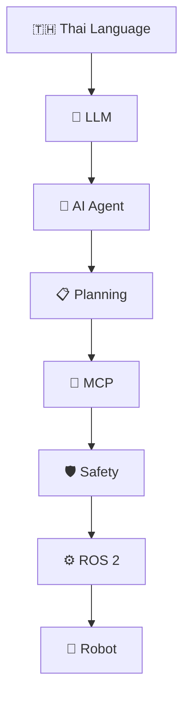

สมการพื้นฐาน

$$
Thai\ Language
\rightarrow
LLM
\rightarrow
Agent
\rightarrow
MCP
\rightarrow
ROS2
\rightarrow
Robot
$$

จุดนี้สามารถกลายเป็น contribution ของงานวิจัยได้ หากออกแบบ Architecture, Protocol, Algorithm และ Evaluation อย่างเป็นระบบ

---

# 19. Research Gap: Closed-Loop Robot Agent

ระบบควรเป็น Closed Loop

$$
Command
\rightarrow
Plan
\rightarrow
Action
\rightarrow
Observation
\rightarrow
Feedback
\rightarrow
Replanning
$$

แทนระบบแบบ Open Loop

$$
Command
\rightarrow
Plan
\rightarrow
Action
$$

ตัวอย่าง

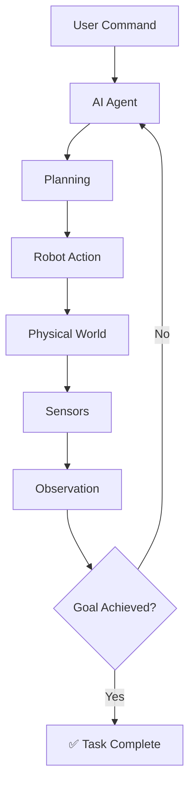

---

# 20. Research Gap: Safety

เมื่อ Agent สามารถเรียก Tool ได้เอง จะเกิดความเสี่ยง เช่น

* สั่ง Robot ผิด
* เลือก Object ผิด
* เคลื่อนที่ไปพื้นที่อันตราย
* Collision
* Unsafe Manipulation

ดังนั้นควรมี Safety Layer

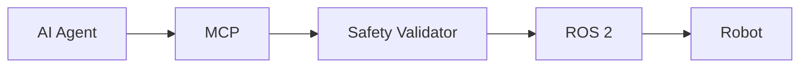

กำหนดเงื่อนไข

$$
Safety(a_t)=
\begin{cases}
1 & \text{ถ้า Action ปลอดภัย}\
0 & \text{ถ้า Action ไม่ปลอดภัย}
\end{cases}
$$

และให้ Robot ดำเนินการเฉพาะเมื่อ

$$
Safety(a_t)=1
$$

---

# 21. Research Gap: Explainable Robot Agent

Robot Agent ควรสามารถอธิบายการตัดสินใจได้

```text
Goal:
นำขวดน้ำมาให้ผู้ใช้

Reasoning:
1. ขวดน้ำอยู่ในห้องครัว
2. Robot สามารถไปห้องครัวได้
3. Camera พบขวดน้ำ
4. Robot Arm สามารถหยิบได้
5. เส้นทางกลับปลอดภัย

Action:
Navigate → Detect → Pick → Return → Deliver
```

สามารถกำหนด

$$
Decision
\rightarrow
Reason
\rightarrow
Action
$$

เป็นองค์ประกอบของ **Explainable Agentic Robotics**

---

# 22. Research Gap: Evaluation

การประเมิน Robot Agent ไม่ควรวัดเฉพาะ Accuracy

สามารถสร้าง Composite Score

$$
Score=
w_1I+
w_2P+
w_3A+
w_4S+
w_5T+
w_6E
$$

โดย

| ตัวแปร | ความหมาย             |
| ------ | -------------------- |
| $I$    | Intent Accuracy      |
| $P$    | Planning Success     |
| $A$    | Action Success       |
| $S$    | Safety               |
| $T$    | Task Completion Time |
| $E$    | Energy Efficiency    |

ตัวอย่าง Metrics ที่สามารถใช้ในการทดลอง

```text
Intent Accuracy
Goal Accuracy
Planning Success Rate
Tool Calling Accuracy
Navigation Success Rate
Object Detection Accuracy
Manipulation Success Rate
Task Completion Rate
Task Completion Time
Collision Rate
Unsafe Action Rate
Replanning Success Rate
```

---

# 23. Proposed Research Framework

จากงานวิจัยที่ศึกษา สามารถเสนอ Framework สำหรับ **Thai Language-Based Robot Agent** ได้ดังนี้

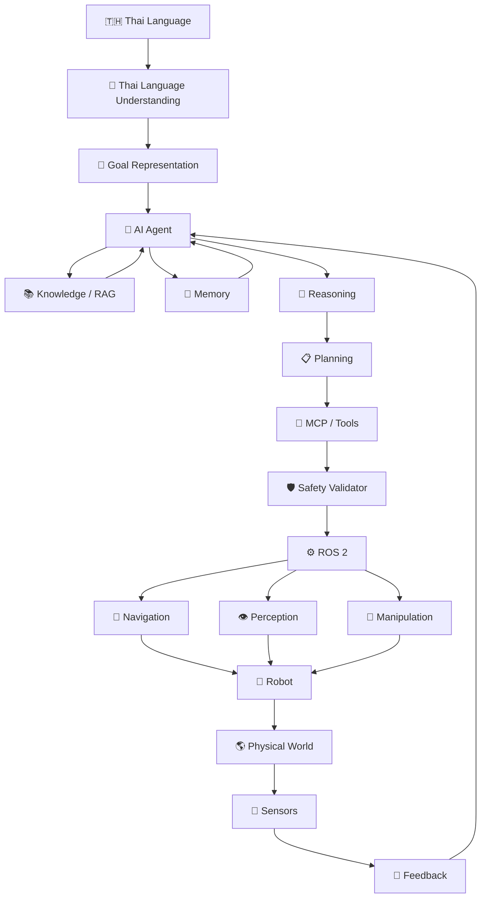

---

# 24. Mathematical Framework

ระบบทั้งหมดสามารถอธิบายด้วยสมการต่อไปนี้

## 24.1 Language Understanding

$$
\boxed{
z_t=f_{NLU}(u_t)
}
$$

แปลงคำสั่งภาษาไทยเป็น Semantic Representation

---

## 24.2 Goal Generation

$$
\boxed{
g_t=f_G(z_t)
}
$$

แปลงความหมายเป็น Goal

---

## 24.3 Planning

$$
\boxed{
P_t=f_P(g_t,s_t,k_t,m_t)
}
$$

โดย

* $g_t$ = Goal
* $s_t$ = Robot State
* $k_t$ = Knowledge
* $m_t$ = Memory
* $P_t$ = Plan

---

## 24.4 Action Selection

$$
\boxed{
a_t=\pi(P_t,s_t,o_t)
}
$$

Agent เลือก Action

---

## 24.5 Robot State Transition

$$
\boxed{
s_{t+1}=f_R(s_t,a_t,w_t)
}
$$

Robot เปลี่ยนจาก State หนึ่งไปอีก State หนึ่ง

---

## 24.6 Observation

$$
\boxed{
o_{t+1}=h(s_{t+1},v_t)
}
$$

Sensor สร้าง Observation

---

## 24.7 Feedback

$$
\boxed{
o_{t+1}\rightarrow Agent
}
$$

Agent นำ Observation กลับมาประเมิน

---

# 25. สมการรวมของ Robot Agent

สามารถรวมเป็น

$$
\boxed{
u_t
\rightarrow
z_t
\rightarrow
g_t
\rightarrow
P_t
\rightarrow
a_t
\rightarrow
s_{t+1}
\rightarrow
o_{t+1}
\rightarrow
Agent
}
$$

หรือ

$$
\boxed{
Understand
\rightarrow
Reason
\rightarrow
Plan
\rightarrow
Act
\rightarrow
Observe
\rightarrow
Feedback
\rightarrow
Replan
}
$$

นี่คือโครงสร้างหลักของ **Agentic Robotics**

---

# 26. ตัวอย่างระบบจริง

คำสั่ง

> **"เอาขวดน้ำจากห้องครัวมาให้ฉัน"**

## ขั้นที่ 1 — Understanding

```text
Intent   = Fetch
Object   = Water Bottle
Location = Kitchen
Target   = User
```

## ขั้นที่ 2 — Goal

$$
g=Fetch(WaterBottle,Kitchen,User)
$$

## ขั้นที่ 3 — Planning

$$
P=[
Navigate,
Detect,
Pick,
Return,
Deliver
]
$$

## ขั้นที่ 4 — MCP

```text
navigate_to("kitchen")
```

## ขั้นที่ 5 — ROS 2

```text
MCP
 ↓
ROS 2
 ↓
Navigation
```

## ขั้นที่ 6 — Vision

```text
Camera
 ↓
Object Detection
 ↓
Water Bottle
```

## ขั้นที่ 7 — Manipulation

```text
Robot Arm
 ↓
Grasp
 ↓
Lift
```

## ขั้นที่ 8 — Feedback

```text
Sensor
 ↓
ตรวจสอบว่าหยิบสำเร็จหรือไม่
 ↓
AI Agent
```

## ขั้นที่ 9 — Replanning

ถ้าหยิบไม่สำเร็จ

$$
Observation
\rightarrow
Reasoning
\rightarrow
Replanning
$$

---

# 27. Conceptual Model

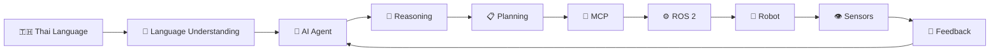

---

# 28. สมมติฐานการวิจัย

## H1

Thai Language Understanding มีผลต่อความถูกต้องของ Goal Representation

$$
TLU\rightarrow GoalAccuracy
$$

## H2

AI Agent Reasoning มีผลต่อ Planning Success

$$
Reasoning\rightarrow PlanningSuccess
$$

## H3

MCP Tool Layer ช่วยเพิ่มความสำเร็จของ Tool Execution

$$
MCP\rightarrow ToolExecution
$$

## H4

Feedback Loop ช่วยเพิ่ม Task Completion Rate

$$
Feedback\rightarrow TaskSuccess
$$

## H5

Safety Layer ช่วยลด Unsafe Robot Actions

$$
SafetyLayer\rightarrow Safety
$$

---

# 29. แนวทางการทดลอง

สามารถออกแบบการทดลองเป็น 4 ระดับ

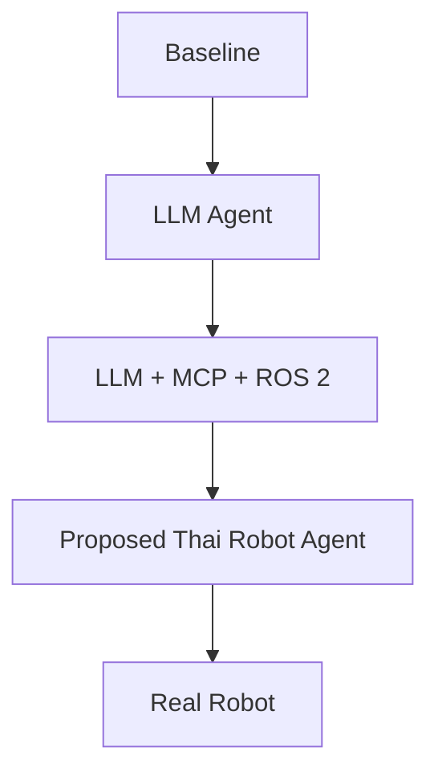

### Baseline 1

Rule-Based Robot

### Baseline 2

English LLM Robot Agent

### Baseline 3

LLM + MCP + ROS 2

### Proposed

Thai Language + AI Agent + MCP + ROS 2 + Feedback + Safety

---

# 30. ตัวแปรสำหรับการทดลอง

| ประเภท               | ตัวแปร             |
| -------------------- | ------------------ |
| Independent Variable | Language Interface |
| Independent Variable | Agent Architecture |
| Independent Variable | Feedback Mechanism |
| Independent Variable | MCP                |
| Independent Variable | Safety Layer       |
| Dependent Variable   | Intent Accuracy    |
| Dependent Variable   | Planning Success   |
| Dependent Variable   | Task Success       |
| Dependent Variable   | Execution Time     |
| Dependent Variable   | Collision Rate     |
| Dependent Variable   | Replanning Rate    |

---

# 31. Research Contribution ที่เป็นไปได้

งานวิจัยสามารถสร้าง Contribution ได้ 5 ด้าน

### Contribution 1 — Thai Language Grounding

สร้างวิธีแปลงภาษาไทยเป็น Robot Goal

$$
Thai
\rightarrow
Goal
$$

### Contribution 2 — Agent Architecture

สร้างสถาปัตยกรรม

$$
LLM
+
Agent
+
MCP
+
ROS2
$$

### Contribution 3 — Closed-Loop Planning

สร้างระบบ

$$
Plan
\rightarrow
Action
\rightarrow
Feedback
\rightarrow
Replan
$$

### Contribution 4 — Safety

สร้าง Safety Validation ก่อนส่งคำสั่งไป Robot

### Contribution 5 — Evaluation Framework

สร้าง Benchmark สำหรับประเมิน

> **Thai Language → AI Agent → Robot Task Execution**

---

# 32. ชื่อหัวข้องานวิจัยที่เสนอ

## ตัวเลือกที่ 1

**Thai Language-Based AI Agent for Embodied Robot Control Using MCP and ROS 2**

## ตัวเลือกที่ 2

**A Thai Language Grounded AI Agent Framework for Autonomous Robot Task Planning and Execution**

## ตัวเลือกที่ 3

**An Agentic Robotics Framework for Thai Natural Language Understanding, Planning, and Closed-Loop Robot Control**

## ตัวเลือกที่ 4

**ThaiLang-RobotAgent: A Language-Grounded Framework for Intelligent Robot Planning and Physical Interaction**

## ตัวเลือกที่ 5

**ThaiLang-Agent: A Closed-Loop Large Language Model Agent for Thai Language-Grounded Robotic Task Planning and Execution**

---

# 33. สรุป Literature Review

จากงานวิจัยย้อนหลัง 10 ปี จะเห็นวิวัฒนาการจาก

$$
Robot
\rightarrow
Language\ Robot
\rightarrow
LLM\ Robot
\rightarrow
Embodied\ AI
\rightarrow
VLA
\rightarrow
Generalist\ Robot
\rightarrow
Agentic\ Robotics
$$

โดยงานสำคัญแต่ละกลุ่มมีบทบาทแตกต่างกัน

```text
SayCan
   ↓
Language + Robot Skills

Inner Monologue
   ↓
Reasoning + Feedback

Code as Policies
   ↓
Language → Robot Program

LLM+P
   ↓
LLM + Classical Planning

PaLM-E
   ↓
Language + Vision + Robot State

RT-2
   ↓
Vision + Language + Action

VoxPoser
   ↓
Language + 3D Motion

Open X-Embodiment
   ↓
Generalist Robot Dataset

Octo
   ↓
Generalist Robot Policy

OpenVLA
   ↓
Open Vision-Language-Action

Gemini Robotics
   ↓
Physical AI
```

ดังนั้น Research Direction ที่น่าสนใจคือ

$$
\boxed{
Thai\ Language
+
LLM
+
AI\ Agent
+
MCP
+
ROS2
+
VLA
+
Feedback
+
Safety
}
$$

เพื่อสร้าง

$$
\boxed{
Thai\ Language
\rightarrow
Reasoning
\rightarrow
Planning
\rightarrow
Robot\ Action
\rightarrow
Physical\ Feedback
}
$$

ซึ่งสามารถต่อยอดเป็น **Prototype + Experimental Framework + Benchmark + Research Paper** ได้

---

# 34. เอกสารอ้างอิง IEEE

```text
[1] A. Ahn et al., “Do As I Can, Not As I Say: Grounding Language in Robotic Affordances,” arXiv preprint arXiv:2204.01691, 2022.

[2] W. Huang et al., “Inner Monologue: Embodied Reasoning through Planning with Language Models,” in Proc. 6th Conf. Robot Learning (CoRL), PMLR, vol. 205, pp. 1769–1782, 2023.

[3] J. Liang et al., “Code as Policies: Language Model Programs for Embodied Control,” arXiv preprint arXiv:2209.07753, 2022.

[4] B. Liu et al., “LLM+P: Empowering Large Language Models with Optimal Planning Proficiency,” arXiv preprint arXiv:2304.11477, 2023.

[5] S. Vemprala, R. Bonatti, A. Bucker, and A. Kapoor, “ChatGPT for Robotics: Design Principles and Model Abilities,” arXiv preprint arXiv:2306.17582, 2023.

[6] D. Driess et al., “PaLM-E: An Embodied Multimodal Language Model,” in Proc. 40th Int. Conf. Machine Learning (ICML), PMLR, vol. 202, pp. 8469–8488, 2023.

[7] B. Zitkovich et al., “RT-2: Vision-Language-Action Models Transfer Web Knowledge to Robotic Control,” in Proc. 7th Conf. Robot Learning (CoRL), PMLR, vol. 229, pp. 2165–2183, 2023.

[8] W. Huang et al., “VoxPoser: Composable 3D Value Maps for Robotic Manipulation with Language Models,” in Proc. 7th Conf. Robot Learning (CoRL), 2023.

[9] Open X-Embodiment Collaboration et al., “Open X-Embodiment: Robotic Learning Datasets and RT-X Models,” arXiv preprint arXiv:2310.08864, 2023.

[10] D. Ghosh et al., “Octo: An Open-Source Generalist Robot Policy,” in Proc. Robotics: Science and Systems (RSS), 2024.

[11] M. J. Kim et al., “OpenVLA: An Open-Source Vision-Language-Action Model,” arXiv preprint arXiv:2406.09246, 2024.

[12] Gemini Robotics Team, “Gemini Robotics: Bringing AI into the Physical World,” arXiv preprint arXiv:2503.20020, 2025.
```

## 35. สรุปสำหรับพัฒนาต่อเป็น Paper

แกนของงานวิจัยสามารถสรุปเป็นโมเดลเดียวได้ว่า

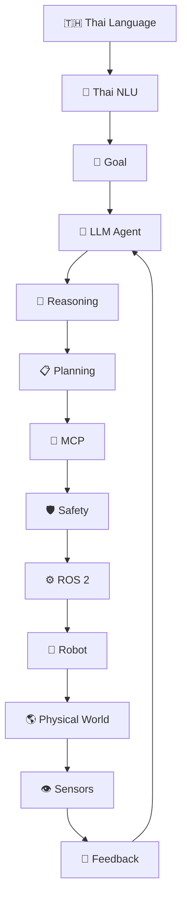

สมการหลักของงานคือ

$$
\boxed{
u_t
\rightarrow
z_t
\rightarrow
g_t
\rightarrow
P_t
\rightarrow
a_t
\rightarrow
s_{t+1}
\rightarrow
o_{t+1}
\rightarrow
Agent
}
$$

หรือสรุปเป็นประโยคเดียว:

> **“ให้หุ่นยนต์เข้าใจภาษาไทย → คิด → วางแผน → เรียกใช้เครื่องมือ → ทำงานผ่าน ROS 2 → รับรู้โลกจริง → ตรวจสอบผลลัพธ์ → และคิดใหม่จนบรรลุเป้าหมาย”**

นี่คือแกนกลางของ **Thai Language-Based Agentic Robotics** และเป็นทิศทางที่สามารถพัฒนาเป็นงานวิจัยเชิงระบบ โดยมีทั้ง **Novel Architecture, Algorithm, Prototype, Benchmark และ Real-Robot Evaluation** ได้.
