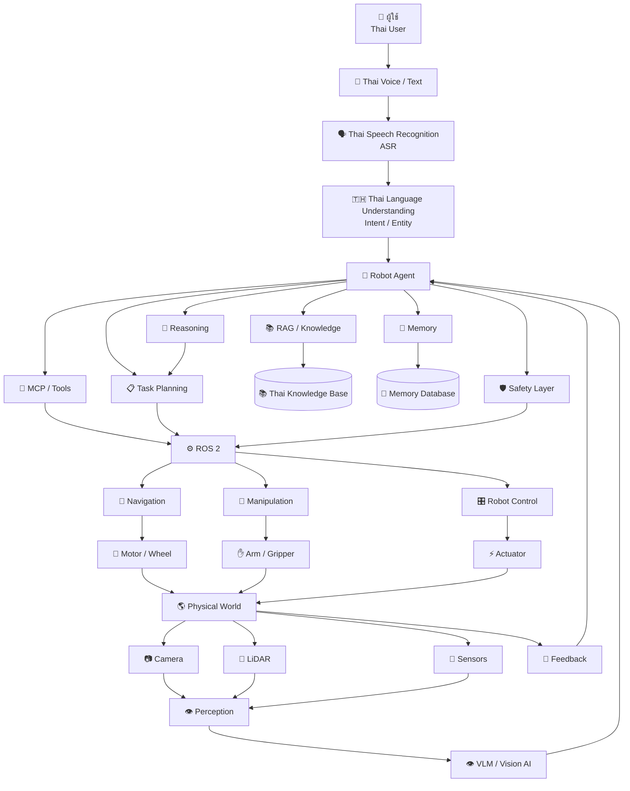
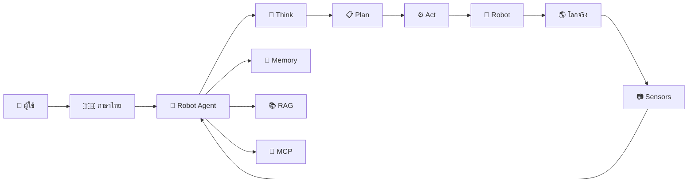
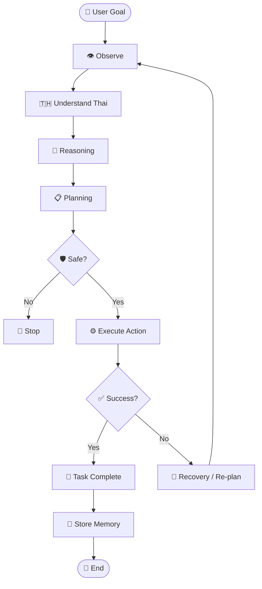
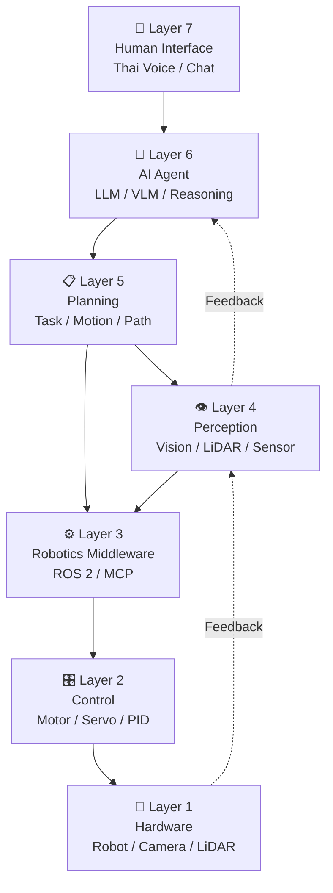
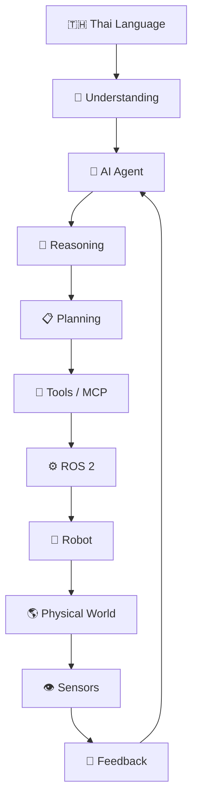

# Robot Agent Thai Project 🇹🇭🤖

**Robot Agent Thai Project** สามารถออกแบบเป็นโครงการสำหรับพัฒนา **หุ่นยนต์ AI ที่เข้าใจภาษาไทย สามารถรับคำสั่งภาษาไทย วิเคราะห์สถานการณ์ วางแผน และลงมือปฏิบัติในโลกจริง**

แนวคิดหลักคือ

> **ภาษาไทย → AI Agent → Reasoning → Planning → Robot Action → Feedback**

---

ได้เลยครับ ถ้าหมายถึง **เขียน Diagram ด้วย Mermaid** สำหรับ **Robot Agent Thai Project** สามารถใช้ Diagram นี้ได้เลย



## ภาพรวมแบบง่าย



## Robot Agent Thai — Agent Loop



## Architecture แบบ Layer



### แนวคิดหลักของระบบ


```text
🇹🇭 Thai Language
       ↓
🧠 Understanding
       ↓
🤖 AI Agent
       ↓
🧠 Reasoning
       ↓
📋 Planning
       ↓
🔌 Tools / MCP
       ↓
⚙️ ROS 2
       ↓
🤖 Robot
       ↓
🌎 Physical World
       ↓
👁️ Sensors
       ↓
🔄 Feedback
       ↺
   AI Agent
```

นี่จะได้เป็น **Robot Agent Thai Architecture** ที่เชื่อมครบตั้งแต่ **ภาษาไทย → LLM → Agent → RAG/Memory/MCP → ROS 2 → Robot → Sensor Feedback** ครับ

    
## 1. แนวคิดของโครงการ

Robot Agent ทั่วไปอาจรับคำสั่ง เช่น

> “Go to the kitchen and bring me a bottle of water.”

แต่ **Robot Agent Thai** จะเน้นให้ผู้ใช้สื่อสารกับหุ่นยนต์ด้วยภาษาไทย เช่น

> **“ไปเอาขวดน้ำในห้องครัวมาให้ฉันหน่อย”**

ระบบจะต้องเปลี่ยนคำสั่งภาษาไทยให้เป็น **Task ที่หุ่นยนต์สามารถปฏิบัติได้**

```text
ผู้ใช้
  │
  │ "ไปเอาขวดน้ำมาให้ฉัน"
  ▼
Thai Speech / Text
  │
  ▼
Thai Language Understanding
  │
  ▼
AI Agent
  │
  ▼
Reasoning
  │
  ▼
Task Planning
  │
  ▼
Robot Action
  │
  ▼
Environment
  │
  ▼
Sensor Feedback
  │
  └──────────► AI Agent
```

---

# 2. เป้าหมายของ Robot Agent Thai

โครงการสามารถกำหนดเป้าหมายหลัก 6 ด้าน

### 1. Thai Language Understanding

ให้ Robot เข้าใจภาษาไทย เช่น

* คำสั่ง
* คำถาม
* ตำแหน่ง
* เวลา
* จำนวน
* วัตถุ
* คำกริยา
* บริบท

ตัวอย่าง

> “หยิบแก้วบนโต๊ะให้หน่อย”

ระบบต้องเข้าใจว่า

```text
Action = Pick
Object = Glass
Location = Table
Target = User
```

---

### 2. Thai Voice Command

รองรับการสั่งงานด้วยเสียง

```text
เสียงภาษาไทย
      ↓
Speech-to-Text
      ↓
ข้อความภาษาไทย
      ↓
Thai LLM
      ↓
Robot Agent
```

ตัวอย่าง

> “ช่วยไปปิดไฟในห้องนอนให้หน่อย”

---

### 3. Thai Reasoning

Robot ต้องไม่เพียงแค่แปลภาษา แต่ต้อง **เข้าใจเจตนา**

เช่น

> “ข้างนอกร้อนมาก เปิดแอร์ให้หน่อย”

คำสั่งไม่ได้พูดตรง ๆ ว่า

```text
Turn ON Air Conditioner
```

แต่ Agent ต้องอนุมานว่า

```text
User Intent
      ↓
Comfort Request
      ↓
Turn ON AC
      ↓
Set appropriate temperature
```

นี่คือส่วนที่ทำให้ระบบมีความเป็น **Agent** มากกว่า Voice Command ธรรมดา

---

# 3. Architecture ของ Robot Agent Thai

```text
┌─────────────────────────────────────────┐
│              USER                       │
│ "ไปเอาน้ำมาให้ฉันหน่อย"                  │
└───────────────────┬─────────────────────┘
                    │
                    ▼
        ┌───────────────────────┐
        │ Thai Speech / Text    │
        │ ASR / NLP             │
        └───────────┬───────────┘
                    ▼
        ┌───────────────────────┐
        │ Thai Language Model   │
        │ LLM / VLM             │
        └───────────┬───────────┘
                    ▼
        ┌───────────────────────┐
        │ Robot Agent           │
        │                       │
        │ Reasoning             │
        │ Planning              │
        │ Memory                │
        │ Decision              │
        └───────────┬───────────┘
                    ▼
        ┌───────────────────────┐
        │ Tool / MCP Layer      │
        └───────────┬───────────┘
                    ▼
        ┌───────────────────────┐
        │ ROS 2                 │
        │ Navigation / Control  │
        └───────────┬───────────┘
                    ▼
        ┌───────────────────────┐
        │ Physical Robot        │
        │ Camera / LiDAR / IMU  │
        │ Motor / Arm / Gripper │
        └───────────┬───────────┘
                    │
                    ▼
               REAL WORLD
                    │
                    ▼
                 Feedback
                    │
                    └──────────► Agent
```

---

# 4. ส่วนประกอบสำคัญ

## 4.1 Thai Speech Recognition

ระบบรับเสียงภาษาไทยจากผู้ใช้

```text
Microphone
    ↓
Thai ASR
    ↓
"ไปหาขวดน้ำในห้องครัว"
```

ผลลัพธ์คือข้อความที่ส่งต่อให้ Agent

---

## 4.2 Thai Language Understanding

Agent วิเคราะห์ประโยค

```text
"ไปหาขวดน้ำในห้องครัว"
```

เป็น Structured Task

```json
{
  "intent": "find_object",
  "object": "water_bottle",
  "location": "kitchen"
}
```

---

# 5. Task Planning

จากคำสั่งเดียว Agent สามารถแตกงานออกเป็นหลายขั้นตอน

ตัวอย่าง:

> **“ไปเอาขวดน้ำในห้องครัวมาให้ฉัน”**

Agent สร้างแผน:

```text
Task
 │
 ├── Locate Kitchen
 │
 ├── Navigate to Kitchen
 │
 ├── Detect Water Bottle
 │
 ├── Navigate to Bottle
 │
 ├── Pick Bottle
 │
 ├── Verify Object
 │
 ├── Navigate to User
 │
 └── Deliver Bottle
```

นี่คือ **Task Decomposition**

---

# 6. Thai Knowledge + RAG

Robot Agent Thai สามารถมี Knowledge Base ภาษาไทย

ตัวอย่าง Knowledge:

```text
ข้อมูลบ้าน
ข้อมูลห้อง
ข้อมูลสิ่งของ
คู่มือการใช้งาน
กฎความปลอดภัย
แผนที่
ข้อมูลผู้ใช้
```

และใช้ RAG

```text
User Question
      ↓
Thai Query
      ↓
Embedding
      ↓
Vector Database
      ↓
Thai Knowledge
      ↓
Retrieved Context
      ↓
Robot Agent
```

ตัวอย่าง:

> “ยาอยู่ที่ไหน?”

Agent ค้นหา Knowledge แล้วพบว่า

```text
Medicine Cabinet
→ Bedroom
→ Second Floor
→ Left Cabinet
```

จากนั้นจึงวางแผนการเดินทาง

---

# 7. Thai Robot Memory

ระบบสามารถสร้าง Memory ภาษาไทย

### Short-Term Memory

```text
"ตอนนี้ฉันอยู่ในห้องครัว"
```

### Long-Term Memory

```text
"ขวดน้ำมักจะอยู่ในตู้เย็น"
```

### Episodic Memory

```text
"เมื่อวานฉันพบขวดน้ำบนชั้นที่ 2"
```

ดังนั้น Robot สามารถเรียนรู้บริบทจากประสบการณ์เดิมได้

---

# 8. Vision + ภาษาไทย

จุดเด่นอีกอย่างของโครงการคือ **Thai Vision-Language Robot**

ตัวอย่างผู้ใช้ถามว่า

> “บนโต๊ะมีอะไรบ้าง?”

Camera ถ่ายภาพ

```text
Camera
   ↓
Vision Model
   ↓
Object Detection
   ↓
Objects
   ├── แก้วน้ำ
   ├── โทรศัพท์
   ├── หนังสือ
   └── ปากกา
   ↓
Thai Response
```

Robot ตอบ:

> “บนโต๊ะมีแก้วน้ำ โทรศัพท์ หนังสือ และปากกาครับ”

---

# 9. Thai Voice → Robot Action

ตัวอย่างการทำงานแบบครบวงจร

### ผู้ใช้พูด

> **“ช่วยเปิดประตูห้องให้หน่อย”**

### Step 1

Speech-to-Text

```text
ช่วยเปิดประตูห้องให้หน่อย
```

### Step 2

Intent Understanding

```text
Intent = Open Door
Object = Door
Action = Open
```

### Step 3

Reasoning

```text
ค้นหาประตู
ตรวจสอบว่าปลอดภัย
เคลื่อนที่ไปยังประตู
```

### Step 4

Planning

```text
Navigate
→ Detect Door
→ Detect Handle
→ Move Arm
→ Grab Handle
→ Rotate
→ Open
→ Verify
```

### Step 5

Robot Action

```text
ROS 2
 ↓
Navigation
 ↓
Arm Controller
 ↓
Gripper
 ↓
Door Open
```

### Step 6

Verification

Camera ตรวจสอบ

```text
Door Open = TRUE
```

Agent ตอบผู้ใช้:

> **“เปิดประตูให้แล้วครับ”**

---

# 10. Multi-Agent สำหรับ Robot Agent Thai

โครงการสามารถพัฒนาเป็น **Multi-Agent Robot System**

```text
                    Thai Master Agent
                           │
          ┌────────────────┼────────────────┐
          ▼                ▼                ▼
     Language Agent   Vision Agent    Planning Agent
          │                │                │
          ▼                ▼                ▼
       ภาษาไทย           Camera          Task Plan
                           │
                           ▼
                    Navigation Agent
                           │
                           ▼
                    Manipulation Agent
                           │
                           ▼
                         Robot
```

แต่ละ Agent รับผิดชอบเฉพาะด้าน

| Agent               | หน้าที่            |
| ------------------- | ------------------ |
| Thai Language Agent | เข้าใจภาษาไทย      |
| Vision Agent        | เข้าใจภาพ          |
| Planning Agent      | วางแผน             |
| Navigation Agent    | เดินทาง            |
| Manipulation Agent  | ควบคุมแขนกล        |
| Safety Agent        | ตรวจสอบความปลอดภัย |
| Memory Agent        | จัดการความจำ       |
| Master Agent        | ประสานงานทั้งหมด   |

---

# 11. Technology Stack

ตัวอย่าง Stack สำหรับโครงการ

```text
Frontend
├── Next.js
├── React
└── WebSocket

AI Layer
├── LLM
├── VLM
├── Thai NLP
├── Reasoning
└── Agent Framework

Knowledge
├── RAG
├── Vector Database
└── GraphRAG

Tool Layer
├── MCP
└── Robot APIs

Robotics
├── ROS 2
├── Navigation
├── SLAM
├── Motion Planning
└── Control

Hardware
├── Raspberry Pi / Jetson
├── Camera
├── LiDAR
├── IMU
├── Motor
├── Servo
└── Robotic Arm
```

---

# 12. ตัวอย่าง Use Cases ในประเทศไทย 🇹🇭

## 🏠 Smart Home Robot

คำสั่ง:

> “ช่วยปิดไฟห้องนั่งเล่นให้หน่อย”

Robot:

```text
Understand
 ↓
Locate Living Room
 ↓
Find Smart Switch
 ↓
Turn Off
 ↓
Verify
```

---

## 🏥 Healthcare Assistant Robot

ตัวอย่าง:

> “ช่วยนำอาหารไปให้คุณยาย”

ระบบ:

```text
Identify Person
 ↓
Locate Food
 ↓
Navigate
 ↓
Avoid Obstacles
 ↓
Deliver
```

ในกรณีใช้งานจริงด้านสุขภาพต้องมีข้อกำหนดด้านความปลอดภัยและการกำกับดูแลที่เข้มงวด

---

## 🏭 Factory Robot

คำสั่ง:

> “ตรวจสอบชิ้นงานล็อตนี้ให้หน่อย”

Robot:

```text
Receive Task
 ↓
Locate Production Line
 ↓
Camera Inspection
 ↓
Defect Detection
 ↓
Record Result
 ↓
Report
```

---

## 🌾 Agricultural Robot

คำสั่ง:

> “ช่วยตรวจต้นทุเรียนแปลงนี้ว่ามีต้นไหนผิดปกติ”

Robot:

```text
Navigate Farm
 ↓
Capture Images
 ↓
Plant Detection
 ↓
Disease / Stress Analysis
 ↓
Record GPS
 ↓
Generate Report
```

---

# 13. Research Framework

ถ้าพัฒนา **Robot Agent Thai** ในระดับงานวิจัย สามารถกำหนด Research Framework ได้

```text
Thai Language
      │
      ▼
Thai Language Understanding
      │
      ▼
Intent + Task Extraction
      │
      ▼
Reasoning
      │
      ▼
Task Planning
      │
      ▼
Robot Execution
      │
      ▼
Sensor Feedback
      │
      ▼
Verification
      │
      ▼
Re-planning
```

และวัดผลด้วย Metrics เช่น

* Thai Command Understanding Accuracy
* Intent Accuracy
* Object Detection Accuracy
* Task Completion Rate
* Planning Success Rate
* Navigation Success Rate
* Task Execution Time
* Failure Recovery Rate
* Safety Violation Rate
* Human-Robot Interaction Satisfaction

---

# 14. จุดเด่นของ Robot Agent Thai

สิ่งที่ทำให้โครงการนี้น่าสนใจคือการสร้างระบบที่เน้น **ภาษาไทย + Agentic Robotics**

```text
Thai Language
      +
Thai Knowledge
      +
Thai Voice
      +
Vision
      +
LLM
      +
Reasoning
      +
RAG
      +
MCP
      +
ROS 2
      +
Robot
      ↓
🇹🇭 ROBOT AGENT THAI
```

แนวคิดนี้จึงสามารถพัฒนาได้ตั้งแต่ **Prototype → Research Prototype → Experimental Framework → Real Robot System** และต่อยอดเป็นหัวข้องานวิจัยด้าน **Thai NLP + LLM + Embodied AI + Agentic AI + Robotics + Physical AI** ได้อย่างน่าสนใจ.
